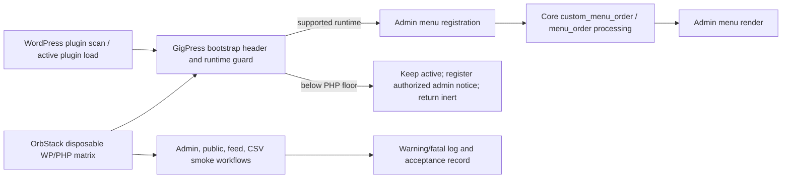

# Phase 1: Compatibility Baseline and Menu Diagnosis - Research

**Researched:** 2026-10-03
**Domain:** Legacy procedural WordPress plugin compatibility, admin-menu ordering, and matrix validation
**Confidence:** MEDIUM

<user_constraints>
## User Constraints (from CONTEXT.md)

### Locked Decisions
- **D-01:** Declare WordPress 7.0 and PHP 8.3 as the minimum supported versions, and validate current upstream-supported releases above those minimums.
- **D-02:** Treat WordPress 7.1.2 with PHP 8.2 as the reported diagnostic environment only. PHP 8.2 is not a support target.
- **D-03:** If GigPress is already active on PHP below 8.3, keep it active but inert. Before including modules or registering normal hooks/functions, register only a persistent compatibility notice for users who can manage plugins and return. The notice repeats while PHP is below 8.3 and disappears automatically on PHP 8.3+; core blocks new activation through `Requires PHP: 8.3`.
- **D-04:** Preserve GigPress's current menu position after Comments and its separator when compatible. If custom ordering conflicts with WordPress or another plugin, use WordPress's standard menu order so GigPress remains warning-free.

### the agent's Discretion
The implementation mechanism for the runtime check, notice, and menu-order correction is for phase research and planning to determine from the existing WordPress integration. The exact root cause of the reported warning remains to be reproduced and confirmed.

### Deferred Ideas (OUT OF SCOPE)
None — discussion stayed within Phase 1 scope.
</user_constraints>

## Project Constraints (from AGENTS.md)

- Prefix shell commands with `rtk`.
- Use Default mode for `$gsd-plan-phase` and `$gsd-execute-phase`.

<phase_requirements>
## Phase Requirements

| ID | Description | Research Support |
|---|---|---|
| COMP-01 | Declare WordPress 7.0 and PHP 8.3 minimums; name only a validated WordPress release in `Tested up to`. | Header/readme ownership and release-matrix evidence below. |
| COMP-02 | Run administration, public display, feed, and CSV workflows on WordPress 7.0/latest 7.1 with PHP 8.3 and each newer upstream-supported PHP branch, without warnings/fatals. | A matrix and workflow smoke protocol, plus PHP parse blockers discovered in the tracked source. |
| COMP-03 | Reproduce and fixture-attribute the exact `separator-gigpress` key, correct GigPress's equivalent late `separator-gp` mutation, and record the unavailable live-site attribution boundary. | Repository history, related historical evidence, reproducible instrumentation, and a safe menu-order pattern below. |
| COMP-04 | Keep an already-active below-floor installation active but inert, with only a persistent capability-scoped notice until PHP 8.3+ returns. | An early conditional bootstrap, header-enforced new activation, and repeated-request lifecycle assertions below. |
</phase_requirements>

## Summary

GigPress needs a focused compatibility slice before wider workflow work: update its declared support contract, remove PHP 8 parser blockers on all workflow paths, implement the active-but-inert below-floor guard, and validate the existing workflows on a disposable WordPress matrix. The official archive lists WordPress 7.0.6 and 7.1.2 as the current releases of their respective lines; PHP lists 8.3, 8.4, and 8.5 as supported branches on this research date. PHP 8.2 remains diagnostic-only by the locked decision. The installed OrbStack runtime supplies the Docker-compatible engine and Compose execution; no host PHP installation is needed. [CITED: https://wordpress.org/download/releases/] [CITED: https://www.php.net/supported-versions.php] [VERIFIED: user-provided environment availability]

The strongest repository diagnosis is that GigPress mutates global `$menu` inside its `menu_order` filter. WordPress 7.1.2 captures its default slug order before applying that filter, flips the filtered and default arrays into ordering maps, and compares unknown rows through the default map. A separator inserted after the snapshot can therefore have no default-map key; if the final filtered order also omits it, sorting reads the absent key. The installed checkout creates `separator-gp`, while the report names `separator-gigpress`; `git log --all -Sseparator-gigpress -- gigpress.php` finds no historical occurrence in this repository. A prior official GigPress support topic reports an `Undefined index: separator-gp` conflict, which is related historical evidence for the same late-menu failure class, not proof of the current live site's actor. The unavailable live site's exact callback identity therefore cannot be proven from repository evidence. [CITED: https://developer.wordpress.org/reference/hooks/menu_order/] [CITED: https://github.com/WordPress/wordpress-develop/blob/7.1.2/src/wp-admin/includes/menu.php] [CITED: https://wordpress.org/support/topic/undefined-index-separator-gp-severe-conflicts-with-other-plugins/] [VERIFIED: repository history search on 2026-10-03]

**Primary recommendation:** Make the runtime/header update and PHP 8 syntax cleanup first; reproduce the menu warning with a controlled trace; then replace the ordering filter with a pure transform that never mutates global `$menu`, falling back to core order when its prerequisites are absent or another ordering callback makes a safe transform impossible. [CITED: https://developer.wordpress.org/reference/hooks/menu_order/]

## Architectural Responsibility Map

| Capability | Primary Tier | Secondary Tier | Rationale |
|---|---|---|---|
| Plugin compatibility declaration and below-minimum handling | API / Backend | WordPress admin | The plugin bootstrap and WordPress plugin-requirements validator own runtime eligibility. [CITED: https://developer.wordpress.org/reference/functions/validate_plugin_requirements/] |
| Admin-menu registration and placement | WordPress admin | API / Backend | WordPress constructs the global admin menu; GigPress supplies its menu page and any order filter. [CITED: https://developer.wordpress.org/reference/hooks/menu_order/] |
| Administration, display, feed, and CSV compatibility checks | API / Backend | Database / Storage | Existing PHP functions execute each workflow; custom tables provide their state. [VERIFIED: admin/db.php:17-71] |
| Compatibility matrix execution | External validation environment | API / Backend | Disposable WordPress instances run through the installed OrbStack engine without changing a production site or requiring host PHP. [VERIFIED: user-provided environment availability] |

## Standard Stack

### Core

| Component | Version | Purpose | Why Standard |
|---|---|---|---|
| WordPress | 7.0.6 and 7.1.2 | Minimum and current 7.1-line host checks | The release archive identifies these patch releases; the selected minimum remains 7.0. [CITED: https://wordpress.org/download/releases/] |
| PHP | 8.3, 8.4, 8.5 | Supported runtime matrix | PHP’s support table lists these branches as supported on 2026-10-03. [CITED: https://www.php.net/supported-versions.php] |
| WordPress plugin headers and readme | WordPress metadata format | Activation eligibility and published compatibility declaration | WordPress documents `Requires at least` and `Requires PHP` in the main file; its readme documentation says `Tested up to` must be an actually tested major release. [CITED: https://developer.wordpress.org/plugins/plugin-basics/header-requirements/] [CITED: https://developer.wordpress.org/plugins/wordpress-org/how-your-readme-txt-works/] |

### Supporting

| Tool | Purpose | When to Use |
|---|---|---|
| OrbStack Docker-compatible Compose runner | Exercise each workflow and collect PHP warnings/fatals | Use the installed OrbStack engine through `docker compose`; resolve each selected WordPress/PHP image pair before executing it and keep all PHP lint/workflow execution in containers. [VERIFIED: user-provided environment availability] |
| PHP lint from the selected runtime | Detect parser failures before browser-driven workflow checks | Run against all shipped PHP files for each supported PHP branch. [ASSUMED] |

**Installation:** No production package, Composer dependency, or npm dependency is needed for this phase. [VERIFIED: repository has no `composer.json` or `package.json`]

## Architecture Patterns

### System Architecture Diagram

### Pattern 1: Keep `menu_order` pure

**What:** The ordering callback may only return an order derived from its input. It must not append a menu row to global `$menu` after WordPress has already built the default slug map. WordPress documents `custom_menu_order` as the gate and `menu_order` as an ordered array of menu slugs. [CITED: https://developer.wordpress.org/reference/hooks/custom_menu_order/] [CITED: https://developer.wordpress.org/reference/hooks/menu_order/]

**Repository evidence:** The source currently contains the following values verbatim:

> `if($current_position = array_search('gigpress/gigpress.php', $menu_order))`
>
> `$menu[] = array('', 'read', 'separator-gp', '', 'wp-menu-separator');`
>
> `$new_menu_order[] =  'separator-gp';`
>
> `$new_menu_order[] = 'gigpress/gigpress.php';`

[VERIFIED: gigpress.php:446-475]

**Plan shape:**

1. Capture the order input, final global menu slugs, returned order, and active `menu_order` callbacks in the WordPress 7.1.2/PHP 8.2 diagnostic run. Do not leave that trace enabled in normal requests. [ASSUMED]
2. Reproduce the exact reported `separator-gigpress` key with a controlled late-menu fixture and require the trace to name that fixture callback and priority. Keep this attribution explicitly fixture-scoped: the checked-out source emits `separator-gp`, repository history contains no `separator-gigpress` occurrence, and the original live callback is unavailable. [VERIFIED: gigpress.php:452] [VERIFIED: gigpress.php:466-467] [VERIFIED: repository history search on 2026-10-03]
3. Correct GigPress's independently proven late `separator-gp` mutation. If an explicit separator is still compatible, create it before WordPress snapshots menu slugs and return its existing slug in the pure ordering result. If menu-order preconditions fail or callback interaction cannot be made deterministic, remove GigPress’s custom ordering filters and let WordPress retain normal order. [CITED: https://github.com/WordPress/wordpress-develop/blob/7.1.2/src/wp-admin/includes/menu.php]

### Pattern 2: Header-enforced activation plus an active-but-inert legacy-site guard

**What:** Put the selected WordPress and PHP minimums in the main plugin header, then keep `readme.txt` aligned. WordPress validates the main-file `Requires at least` and `Requires PHP` values when a plugin is activated. [CITED: https://developer.wordpress.org/reference/functions/validate_plugin_requirements/] [CITED: https://developer.wordpress.org/plugins/wordpress-org/how-your-readme-txt-works/]

**Repository evidence:** The current header lacks those two fields, while the readme still declares the values below verbatim:

> `Requires at least: 3.0`
>
> `Tested up to: 4.3`

[VERIFIED: gigpress.php:2-10] [VERIFIED: readme.txt:1-7]

**Plan shape:** Use `Requires PHP: 8.3` for core's new-activation block, then test an already-active site downgraded to PHP 8.2. In WordPress 7.1.2, `activate_plugin()` calls `validate_plugin_requirements()` before adding a plugin to the active option, while `wp_get_active_and_valid_plugins()` continues loading an existing active-option entry based on its valid path and file presence without reapplying the header requirement. That split makes the selected active-but-inert behavior feasible in normal core loading. The main file must branch before all module includes and normal hook registrations. In the below-floor branch, retain the active-plugin option, register only an escaped admin compatibility notice behind WordPress's plugin-management capability, and return. Keep the existing normal bootstrap inside the complementary supported-runtime branch so normal GigPress functions and hooks are not declared below the floor; a top-level `return` by itself is not sufficient evidence that unconditional declarations are absent. Because the plugin remains active, the same branch runs on later requests, making the notice persistent without an option, MU plugin, or active-state mutation. On PHP 8.3+, execute the normal branch and register no compatibility notice. [CITED: https://github.com/WordPress/wordpress-develop/blob/7.1.2/src/wp-admin/includes/plugin.php#L608-L625] [CITED: https://github.com/WordPress/wordpress-develop/blob/7.1.2/src/wp-includes/load.php#L939-L984] [CITED: https://developer.wordpress.org/reference/hooks/admin_notices/] [CITED: https://developer.wordpress.org/reference/functions/current_user_can/]

### Pattern 3: Remove PHP 8 parse blockers before activation testing

**What:** Convert all curly-brace array/string offset access in files reached by the required workflows to bracket syntax, then lint and execute those paths under every supported branch. PHP removed curly-brace offset syntax in 8.0. [CITED: https://www.php.net/manual/en/migration80.incompatible.php]

**Repository evidence:** Export and CSV code contain the following values verbatim:

> `$show['show_time']{7}`
>
> `$ch = $data{$i};`
>
> `isset($data{$i+1})`
>
> `($value{0} == ' ' || substr($value, -1) == ' ')`

[VERIFIED: gigpress.php:529-547] [VERIFIED: lib/parsecsv.lib.php:289-293] [VERIFIED: lib/parsecsv.lib.php:384-388] [VERIFIED: lib/parsecsv.lib.php:679-688]

**Scope note:** `lib/upgrade.php` also contains curly-brace offsets, but it is only required by legacy JSON fallbacks whose guard is false on current PHP branches. Decide during the full lint pass whether to modernize it mechanically or remove the unreachable fallback; do not change unrelated upgrade/data behavior in this phase. [VERIFIED: output/gigpress_shows.php:217-224] [VERIFIED: output/gigpress_related.php:64-71] [VERIFIED: lib/upgrade.php:2061-2064] [VERIFIED: lib/upgrade.php:2187-2190] [VERIFIED: lib/upgrade.php:2933-2941]

### Anti-Patterns to Avoid

- **Rename a separator from the warning text:** The checkout creates `separator-gp`, not `separator-gigpress`; attribute the exact key only to the controlled fixture and keep the unavailable live actor unproven. [VERIFIED: gigpress.php:452] [VERIFIED: gigpress.php:466-467] [VERIFIED: repository history search on 2026-10-03]
- **Mutate global `$menu` inside `menu_order`:** Core makes its default map before the filter, so a newly appended row can be absent from that map. [CITED: https://github.com/WordPress/wordpress-develop/blob/trunk/src/wp-admin/includes/menu.php]
- **Treat PHP 8.2 as a supported matrix cell:** It is only a reproduction environment under D-02. [ASSUMED: locked user decision]
- **Return before includes while leaving normal declarations unconditional:** PHP compiles the main file before running the guard, and unconditional function declarations do not establish the required inert surface. Put the normal bootstrap inside the supported-runtime branch and verify its hooks/functions are absent below the floor. [ASSUMED: locked user decision]
- **Claim PHP 8.3 compatibility after only changing metadata:** the active export function itself has removed syntax. [VERIFIED: gigpress.php:505-552] [CITED: https://www.php.net/manual/en/migration80.incompatible.php]

## Don't Hand-Roll

| Problem | Don't Build | Use Instead | Why |
|---|---|---|---|
| Minimum-version parsing and activation blocking | A separate custom version parser | WordPress plugin headers and core requirement validation | Core reads the declared requirement headers and returns a validation error for an incompatible runtime. [CITED: https://developer.wordpress.org/reference/functions/validate_plugin_requirements/] |
| Admin-menu ordering | A second independent menu model | The documented `custom_menu_order`/`menu_order` contract or core order | Core owns the menu array lifecycle and keeps unspecified entries in their usual relative order. [CITED: https://developer.wordpress.org/reference/hooks/menu_order/] |
| Reproduction environment | A production-site diagnostic procedure | A disposable WordPress instance with captured logs | The warning must be attributed without changing a site owner’s live menu state. [ASSUMED] |

**Key insight:** The WordPress menu array is a core-owned runtime structure. GigPress should register its own entries and, only when needed, supply a pure slug ordering. [CITED: https://developer.wordpress.org/reference/hooks/menu_order/]

## Common Pitfalls

### Pitfall 1: Truthiness hides the first menu slot

**What goes wrong:** `array_search()` returns `0` when the target is first; the current condition treats that as false and skips the custom path. [VERIFIED: gigpress.php:448-475]

**How to avoid:** Use a strict `!== false` test in any retained ordering transform and explicitly test the target at index zero. [ASSUMED]

### Pitfall 2: The reported separator and checkout separator differ

**What goes wrong:** A one-character or slug-only fix can leave the real contributor unchanged. [VERIFIED: gigpress.php:452] [VERIFIED: gigpress.php:466-467]

**How to avoid:** Preserve the diagnostic trace as a failing regression case only after capturing the exact plugin build and active callbacks. [ASSUMED]

### Pitfall 3: The below-minimum guard leaves part of GigPress active

**What goes wrong:** The active plugin returns after some modules, normal hooks, or unconditional functions have already loaded, so PHP 8.2 requests can still execute incompatible GigPress behavior despite the notice. [ASSUMED]

**How to avoid:** Put the runtime branch before all normal includes and hook registrations, conditionally declare the normal bootstrap only in the supported branch, and assert active state plus the exact registered hook/function surface on separate admin and public requests. [CITED: https://developer.wordpress.org/reference/hooks/admin_notices/]

### Pitfall 4: Parser errors occur before a compatibility guard can run

**What goes wrong:** PHP compiles the bootstrap before executing its version guard; removed syntax in `gigpress.php` can prevent the guard and plugin metadata behavior from being exercised. [VERIFIED: gigpress.php:505-552] [CITED: https://www.php.net/manual/en/migration80.incompatible.php]

**How to avoid:** Apply and lint syntax conversions before activation testing. [ASSUMED]

## State of the Art

| Old Approach | Current Approach | Impact |
|---|---|---|
| Curly-brace string/array offset access | Bracket offset access | Curly-brace support was removed in PHP 8.0, so shipped workflow files must be converted. [CITED: https://www.php.net/manual/en/migration80.incompatible.php] |
| Readme-only requirement declarations | Main plugin-header requirement declarations | WordPress readme documentation says requirement headers are parsed from the main PHP file since WordPress 5.8. [CITED: https://developer.wordpress.org/plugins/wordpress-org/how-your-readme-txt-works/] |

## Assumptions Log

| # | Claim | Section | Risk if Wrong |
|---|---|---|---|
| A1 | OrbStack's Docker-compatible runtime can resolve or build every required WordPress/PHP pair. | Standard Stack / Environment | The executor must fail closed on a missing exact pair and record any image build needed for that pair. |
| A3 | Strict first-index handling and a pure ordering callback are sufficient once all contributors are known. | Patterns / Pitfalls | Another ordering filter may require the standard-order fallback. |

## Open Questions

1. **Which actor creates `separator-gigpress` in the reported environment?**
   - What we know: this checkout creates `separator-gp`; repository history has no `separator-gigpress` occurrence; WordPress’s ordering algorithm can expose a late-added menu slug; and the controlled fixture can prove the diagnostic attributes the exact reported key. The historical GigPress support archive documents an `Undefined index: separator-gp` conflict, which supports the failure class only. [VERIFIED: gigpress.php:452] [VERIFIED: repository history search on 2026-10-03] [CITED: https://github.com/WordPress/wordpress-develop/blob/7.1.2/src/wp-admin/includes/menu.php] [CITED: https://wordpress.org/support/topic/undefined-index-separator-gp-severe-conflicts-with-other-plugins/]
   - What's unclear: the unavailable site's deployed build, active plugins, mu-plugins, theme code, callback order, and exact `separator-gigpress` actor.
   - Recommendation: record that the live actor cannot be proven from repository evidence, do not generalize fixture attribution to production, and correct the checkout's independently observable late `separator-gp` mutation with a warning-free supported-matrix regression. [VERIFIED: repository evidence boundary]

## Environment Availability

| Dependency | Required By | Available | Version | Fallback |
|---|---|---|---|---|
| OrbStack Docker-compatible engine | Disposable matrix | ✓ | Existing installation | Use its `docker`/Compose-compatible interface. [VERIFIED: user-provided environment availability] |
| Docker Compose interface through OrbStack | Disposable matrix definition | ✓ | Existing installation | Run repository Compose scenarios against OrbStack. [VERIFIED: user-provided environment availability] |
| Host PHP CLI | Direct linting | Not required | — | Run all lint and PHP execution in selected OrbStack containers. [VERIFIED: user decision] |
| WordPress CLI | Direct local provisioning | ✗ | — | Use a disposable runner. [VERIFIED: local command probe] |
| WordPress/PHP images | Matrix execution | ✗ cached | — | Pull pinned official images or build the exact pair through OrbStack after availability is confirmed. [VERIFIED: local image inventory plus user-provided runtime] |

**Missing dependencies with no fallback:** None established. [ASSUMED]

**Missing dependencies with fallback:** WordPress CLI and cached WordPress images; provision them inside or pull them through the OrbStack-backed disposable environment. Host PHP is intentionally not part of the plan. [VERIFIED: user decision]

## Validation Architecture

### Test Framework

| Property | Value |
|---|---|
| Framework | None detected — create a disposable integration harness in Wave 0. [VERIFIED: repository inventory] |
| Config file | none [VERIFIED: repository inventory] |
| Quick run command | Manual disposable-site smoke run; command depends on selected runner. [ASSUMED] |
| Full suite command | Matrix smoke run across WordPress 7.0.6/7.1.2 × PHP 8.3/8.4/8.5. [CITED: https://wordpress.org/download/releases/] [CITED: https://www.php.net/supported-versions.php] |

### Phase Requirements → Test Map

| Req ID | Behavior | Test Type | Automated Command | File Exists? |
|---|---|---|---|---|
| COMP-01 | Main header/readme report the selected floors; `Tested up to` is a passed major release. | metadata + matrix evidence | inspect packaged header/readme and recorded matrix result | ❌ Wave 0 |
| COMP-02 | Activate then run existing admin, public, RSS, iCalendar, CSV import, and CSV export workflows with `E_ALL`; collect zero plugin warnings/fatals. | integration smoke | selected disposable-runner matrix command | ❌ Wave 0 |
| COMP-03 | Reproduce PHP 8.2 diagnostic warning, capture menu state/callbacks, then prove zero warning on supported cells. | diagnostic + integration | selected disposable-runner menu trace and matrix command | ❌ Wave 0 |
| COMP-04 | Preserve active state below PHP 8.3 while exposing only the authorized repeated compatibility notice; prove normal hooks/functions/modules are absent and supported behavior resumes at PHP 8.3+. | lifecycle integration | OrbStack-backed runtime-floor scenario across both WordPress lines | ❌ Wave 0 |

### Sampling Rate

- **Per task commit:** lint changed PHP with the selected PHP container and run the smallest relevant smoke cell. [ASSUMED]
- **Per wave merge:** run all supported matrix cells and archive warning/fatal logs. [ASSUMED]
- **Phase gate:** require a matrix record for every COMP requirement before `$gsd-verify-work`. [ASSUMED]

### Wave 0 Gaps

- [ ] Disposable WordPress/PHP matrix definition with a reproducible plugin mount/install step.
- [ ] A controlled menu-order trace that records input order, returned order, final menu slugs, and participating callbacks without persisting diagnostic data.
- [ ] Workflow fixture and checklist for one admin action, public shortcode/list, RSS, iCalendar, CSV export, and CSV import.
- [ ] A result format that records WordPress/PHP versions and warning/fatal output per matrix cell.

## Security Domain

### Applicable ASVS Categories

| ASVS Category | Applies | Standard Control |
|---|---|---|
| V2 Authentication | no | No authentication flow changes. [ASSUMED] |
| V3 Session Management | no | No session-management changes. [ASSUMED] |
| V4 Access Control | yes | Show compatibility feedback only to users who can manage plugins; keep all other GigPress surfaces inert below the floor. [CITED: https://developer.wordpress.org/reference/functions/current_user_can/] |
| V5 Input Validation | yes | Treat runtime/version and diagnostic values as controlled internal data; do not emit raw menu arrays or callback data in a persistent admin notice. [ASSUMED] |
| V6 Cryptography | no | No cryptographic feature changes. [ASSUMED] |

### Known Threat Patterns for this phase

| Pattern | STRIDE | Standard Mitigation |
|---|---|---|
| Unauthorized visibility of compatibility state | Information disclosure | Restrict notices to the intended plugin-management capability and avoid persistent full diagnostic dumps. [ASSUMED] |
| Incompatible normal hooks/functions remain reachable | Denial of service | Branch before all normal modules/hooks, conditionally declare the supported bootstrap, and assert the below-floor runtime surface. [ASSUMED] |

## Sources

### Primary / official documentation

- [WordPress Header Requirements](https://developer.wordpress.org/plugins/plugin-basics/header-requirements/) — main-file header fields.
- [WordPress Plugin Readmes](https://developer.wordpress.org/plugins/wordpress-org/how-your-readme-txt-works/) — requirement-header ownership and `Tested up to` semantics.
- [WordPress menu_order](https://developer.wordpress.org/reference/hooks/menu_order/) and [custom_menu_order](https://developer.wordpress.org/reference/hooks/custom_menu_order/) — menu filter contract.
- [WordPress 7.1.2 menu.php](https://github.com/WordPress/wordpress-develop/blob/7.1.2/src/wp-admin/includes/menu.php) — target-release ordering snapshot, map, and sort lifecycle.
- [WordPress validate_plugin_requirements](https://developer.wordpress.org/reference/functions/validate_plugin_requirements/) — header-driven new-activation gating.
- [WordPress 7.1.2 activate_plugin](https://github.com/WordPress/wordpress-develop/blob/7.1.2/src/wp-admin/includes/plugin.php#L608-L625) and [active plugin loading](https://github.com/WordPress/wordpress-develop/blob/7.1.2/src/wp-includes/load.php#L939-L984) — requirements are checked for activation, while an existing active-option entry remains loadable for the early runtime guard.
- [WordPress admin_notices](https://developer.wordpress.org/reference/hooks/admin_notices/) and [current_user_can](https://developer.wordpress.org/reference/functions/current_user_can/) — persistent request-time notice hook and capability-scoped visibility.
- [WordPress release archive](https://wordpress.org/download/releases/) — current WordPress 7.0/7.1 patch releases.
- [PHP supported versions](https://www.php.net/supported-versions.php) — current upstream PHP branches.
- [PHP 8.0 incompatible changes](https://www.php.net/manual/en/migration80.incompatible.php) — removed curly-brace offset syntax.
- [GigPress support archive: Undefined index: separator-gp — severe conflicts with other plugins](https://wordpress.org/support/topic/undefined-index-separator-gp-severe-conflicts-with-other-plugins/) — related historical evidence for the same separator failure class; not proof of the current reported site's callback identity.

## Metadata

**Confidence breakdown:**

- Standard stack: MEDIUM — runtime versions and metadata semantics come from official sources; target-runner availability remains unproven.
- Architecture: MEDIUM — the core ordering lifecycle and current callback are directly inspected; the unavailable live site's reported separator actor is explicitly outside what repository evidence can prove.
- Pitfalls: HIGH — parser blockers and truthiness defect are visible in source; their supported-runtime impact is documented by PHP.

**Research date:** 2026-10-03
**Valid until:** 2026-10-10 for current upstream release branches; recheck at execution time.
