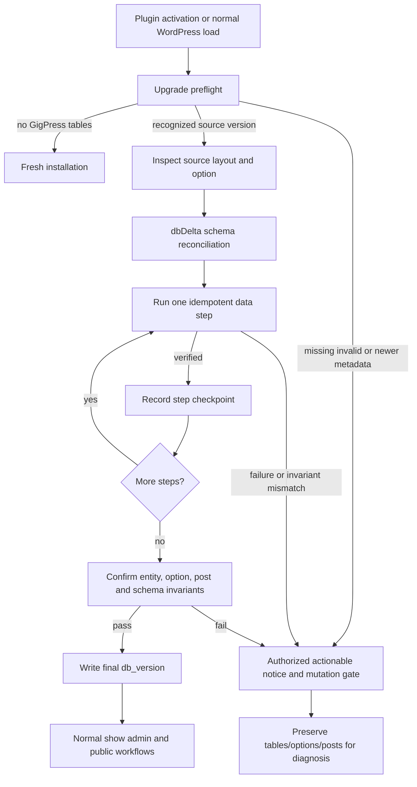

# Phase 2: Data and Upgrade Preservation - Research

**Researched:** 2026-10-04
**Domain:** Safe preservation of legacy WordPress plugin data through schema and data upgrades
**Confidence:** MEDIUM

<user_constraints>
## User Constraints (from CONTEXT.md)

### Locked Decisions

## Implementation Decisions

The user selected all four discussion areas (`1-4`) and then said, "recommendations are fine." The policies below are the agent's recommended decisions under that delegation; the unasked details were not individually selected by the user.

### Upgrade starting points
- **D-01:** Support direct updates from every database version the existing plugin recognizes: 1.0 through the current 1.6. Preserve the existing historical upgrade paths on supported modern runtimes rather than requiring an intermediate plugin installation.
- **D-02:** Inventory historical source schemas and migration branches, then cover each recognized starting version with populated, reproducible fixtures. Include settings, active and trashed records, nontrivial IDs, relationships, and linked WordPress posts where the source schema supports them. Fixtures may share setup for equivalent layouts, but every recognized version must have explicit coverage and expected results. No live-site backup or historical installation has been supplied; label reconstructed fixtures honestly.
- **D-03:** Verify that repeated plugin loads and activation/update transitions do not repeat destructive transformations, duplicate artists or venues, reset options, or change existing record IDs. Retain the active WordPress table prefix. Distinguish a fresh installation from an existing database with missing or invalid version metadata.

### What preserved means
- **D-04:** Preserve existing entity IDs, row contents, show-to-artist/venue/tour relationships, and `show_related` WordPress post references. Existing legacy migrations may transform fields or create newly introduced entities only as needed to preserve their established meaning; define explicit expected before/after results. Do not silently renumber, merge distinct records, discard content, or relink a show to an unrelated entity.
- **D-05:** Preserve saved settings, including intentional empty values, disabled flags, customized labels, and unknown option keys. Supply genuinely missing defaults safely without replacing the complete settings option or treating a deliberately disabled value as absent. Any necessary legacy setting transformation must be documented and verified.
- **D-06:** Retain active and trashed records and their stored dates, times, multi-day/expiration values, notes, ticket links, ordering, and relationships. Preserve existing linked WordPress posts without unexpected creation, deletion, or content changes. Unexpected records or broken references must remain available for diagnosis instead of being silently discarded or replaced with invented data.

### Unexpected or interrupted updates
- **D-07:** When an update cannot safely complete, stop the affected migration and show an actionable notice to an authorized administrator. Preserve stored content and references; do not reset tables/options, delete records, downgrade a newer unknown schema, or guess missing associations as automatic recovery.
- **D-08:** Mark a database upgrade complete only after its required steps are confirmed successful. A failed step must not advance the stored version or produce a false success. Make retry/recovery safe without duplicate records or repeated harmful transformations. Determine the actual mechanism from database and migration evidence; do not assume schema operations can be rolled back atomically.
- **D-09:** Keep WordPress usable while preventing GigPress mutations that depend on an incomplete migration. Research and planning determine which paths can safely continue and the notice wording. This phase does not add a backup/restore product interface or a general-purpose automatic repair tool.

### Trash, restore, and continued show management
- **D-10:** Editing, trashing, and restoring a show retain its ID, content, and artist/venue/tour/post references. Copying creates a distinct show and leaves its source intact, while retaining the existing form and related-post choices. Bulk operations affect only selected shows. Upgrades never empty trash automatically.
- **D-11:** Retain established tour deletion and undo behavior: detach the affected shows when the tour is trashed, then restore eligible associations on undo. Prevent unrelated shows from being attached or deliberate subsequent assignments from being overwritten. Characterize repeated tour deletions and intervening edits before changing the restore path; do not expand this into a new trash-history feature.
- **D-12:** Prevent artist or venue deletion while either active or trashed shows reference the entity, so a later show restore remains usable. Enforce this protection in the mutation handler as well as the visible control. Preserve the existing no-cascade intent and do not silently reassign dependent shows.

### the agent's Discretion

The user delegated recommended choices for these four areas. Researchers and planners may choose fixture organization, migration checks, safe retry mechanics, notice wording, and focused repairs to satisfy these preservation policies. Characterize existing behavior before altering it. Keep the procedural WordPress integration and established data model; a required schema change must carry its own versioned migration and preservation evidence. Authorization to use recommendations completes this discussion; it does not enable automatic planning or execution.

### Deferred Ideas (OUT OF SCOPE)

None were added by the user. Administration UX, public publishing, and CSV improvements remain in Phases 3–5 as already scheduled.
</user_constraints>

<phase_requirements>
## Phase Requirements

| ID | Description | Research Support |
|----|-------------|------------------|
| DATA-01 | Updating GigPress leaves existing show, artist, venue, and tour records, relationships, and saved settings usable without data loss. | Reconstructed fixture matrix for every recognized database source version; identity, row, relation, option, prefix, related-post, failure, and repeat-load assertions. |
| DATA-02 | Site owners can continue to create, edit, copy, trash, and restore shows and manage their artist, venue, and tour relationships using GigPress’s existing data model. | Post-upgrade mutation probe for edit/copy/trash/restore, entity deletion guards, and repeated tour trash/undo behavior. |
</phase_requirements>

## Project Constraints (from AGENTS.md)

- Prefix repository shell commands with `rtk`.
- GSD plan and execution work run in Default mode. [VERIFIED: user-provided AGENTS.md instructions]

## Summary

GigPress’s persistence boundary is four prefix-aware custom tables plus the serialized `gigpress_settings` option and optional `show_related` WordPress post IDs. The current bootstrap declares `GIGPRESS_DB_VERSION` as `'1.6'`, while the existing switch recognizes only source strings `'1.0'` through `'1.5'`; a database already at `'1.6'` has no migration branch. The current schema intentionally keeps the pre-1.4 denormalized venue columns because the old migration consumes them. [VERIFIED: `gigpress.php:38-43`, `admin/db.php:13-15`, `admin/db.php:161-193`]

The existing upgrade code is unsafe for an interrupted or malformed upgrade: it runs `dbDelta()`, invokes every legacy function for the selected source version, then writes the final version with no aggregate result check. The 1.4 path inserts an artist and venues before it updates references, and the 1.6 path edits artist and venue fields row by row. A rerun after partial work can therefore duplicate newly created entities or misreport completion. [VERIFIED: `admin/db.php:156-193`, `admin/db.php:241-324`]

**Primary recommendation:** Keep the four-table model and `dbDelta()`, but replace the implicit all-at-once load-time migration with a preflighted, step-confirmed upgrade coordinator; create explicitly reconstructed source fixtures for `1.0`–`1.5`, verify every required before/after invariant, and leave the database version unchanged when any step cannot be proven complete.

## Architectural Responsibility Map

| Capability | Primary Tier | Secondary Tier | Rationale |
|------------|--------------|----------------|-----------|
| Upgrade coordination and safety gate | API / Backend | Database / Storage | WordPress PHP owns lifecycle decisions; `$wpdb` owns schema/data operations. [VERIFIED: `gigpress.php:35-50`, `admin/db.php:142-195`] |
| Legacy schema reconciliation | Database / Storage | API / Backend | `dbDelta()` and the four custom tables are the persistence boundary; PHP must verify outcomes. [VERIFIED: `admin/db.php:17-71`, `admin/db.php:156-193`] |
| Settings preservation and default completion | API / Backend | Database / Storage | The PHP bootstrap reads and writes the serialized option. [VERIFIED: `admin/db.php:74-140`] |
| Related WordPress post preservation | API / Backend | Database / Storage | `show_related` stores the post ID and output resolves it through WordPress APIs. [VERIFIED: `admin/db.php:31-41`, `gigpress.php:284-301`] |
| Continued show and relationship mutations | API / Backend | Database / Storage | Existing request handlers mutate rows; screens only render routes/forms. [VERIFIED: `admin/handlers.php:220-373`, `admin/handlers.php:724-778`] |
| Fixture setup and evidence capture | API / Backend | Database / Storage | The repository probe bootstraps WordPress and inspects the prefix-scoped tables and options. [VERIFIED: `tests/compat/probe.php:152-167`, `tests/compat/probe.php:230-305`] |

## Standard Stack

### Core

| Library / Runtime | Version | Purpose | Why Standard |
|-------------------|---------|---------|--------------|
| WordPress `$wpdb` and Options API | WordPress 7.0+ baseline | Query the existing custom tables and retain the serialized settings option. | This is the plugin’s present persistence contract; the support floor is a locked project decision. [VERIFIED: `admin/db.php:125-149`, `gigpress.php:454-456`; `02-CONTEXT.md`] |
| WordPress `dbDelta()` | Core API | Reconcile existing custom tables with the established current SQL. | WordPress documents schema modification and returns strings describing update queries; retain it for schema reconciliation, then independently verify semantic data work. [CITED: https://developer.wordpress.org/reference/functions/dbDelta/] |
| Repository Compose harness | Docker 29.4.0 / Compose 5.1.2 locally | Run disposable WordPress, PHP, and MariaDB fixture integration probes. | It already mounts the checkout read-only and isolates volumes. [VERIFIED: `tests/compat/compose.yaml:1-40`; local environment probe] |

### Supporting

| Library / Runtime | Version | Purpose | When to Use |
|-------------------|---------|---------|-------------|
| WordPress nonces and capability checks | Core API | Authorize upgrade notices and preserve mutation boundaries. | Every administrator action or mutation gate. [VERIFIED: `admin/handlers.php:224-228`, `admin/handlers.php:335-341`] |
| `wp_insert_post()` and post APIs | Core API | Preserve existing post links without creating/replacing posts during upgrade. | Only current show creation’s explicit related-post path; never an upgrade repair path. [VERIFIED: `admin/handlers.php:90-140`] |

### Alternatives Considered

| Instead of | Could Use | Tradeoff |
|------------|-----------|----------|
| Targeted coordinator around existing tables and migrations | Replacing tables or exporting/importing all data | Violates the locked preservation boundary and needlessly changes IDs, extensions, and recovery risk. |
| Explicit fixture reconstruction | A claim based on a live production backup | No live site data was supplied; reconstructed fixtures are reproducible evidence, not evidence about a particular site. [VERIFIED: `02-CONTEXT.md:24-26`] |
| Failure notice plus retry-safe checkpoints | A backup/restore or automatic repair product | Explicitly outside the locked scope. |

**Installation:** No new Composer, npm, or production package is appropriate for this phase. [VERIFIED: repository persistence and harness use WordPress core and tracked Compose files]

## Architecture Patterns

### System Architecture Diagram



### Recommended Project Structure

```text
admin/
├── db.php                    # current schema, defaults, upgrade coordinator and legacy transformations
└── handlers.php              # show/entity mutation guards and trash/undo behavior
tests/compat/
├── fixtures/                 # explicitly reconstructed 1.0–1.5 source layouts and expected manifests
├── probe.php                 # fixture loader, upgrade/reload/failure/mutation assertions
└── run.sh                    # disposable cell/matrix entry points
gigpress.php                  # prefix-aware constants and load-time safety gate
```

### Pattern 1: Preflight before migration, commit version last

**What:** Read the raw settings option with a sentinel that distinguishes an absent option from a present empty/false value. Classify fresh installation separately from an existing table set with missing, invalid, or newer metadata. For a recognized source version, run schema work and each data transformation only after its prerequisites are visible. Verify the affected rows and settings after each step; write the final database version only after all expected invariants hold. [CITED: https://developer.wordpress.org/reference/functions/update_option/] [CITED: https://developer.wordpress.org/reference/classes/wpdb/]

**When to use:** Every activation and normal plugin load that could run an upgrade.

**Why:** `wpdb::update()` and `wpdb::query()` use `false` for errors but may return `0` for a valid no-op. The existing code needs strict failure handling, and an unchanged `update_option()` value can also return `false`; use read-after-write validation for the final marker instead of treating one boolean as a complete transaction. [CITED: https://developer.wordpress.org/reference/classes/wpdb/] [CITED: https://developer.wordpress.org/reference/functions/update_option/]

**Existing source values (verbatim):** `define('GIGPRESS_DB_VERSION', '1.6');` and the recognized branches are `case "1.0":`, `case "1.1":`, `case "1.2":`, `case "1.3":`, `case "1.4":`, and `case "1.5":`. [VERIFIED: `gigpress.php:42-43`, `admin/db.php:161-189`]

### Pattern 2: Make legacy data steps idempotent and observable

**What:** Retain legacy field meaning, but split transformations into checkable steps whose retry precondition is based on existing rows and stored per-step evidence, never only on the old source version. For the 1.4 transformation, explicitly map the source show ID to its selected artist and venue ID before changing relationships; for the 1.6 transformation, change only the row that still matches its source representation. Treat a missing source field, failed insert/update, ambiguous mapping, or post-reference mismatch as a stop condition and display an administrator notice.

**When to use:** Rebuilt fixtures for every source version and every retry/interruption test.

**Evidence:** The current 1.4 migration blindly inserts the default artist and each distinct legacy venue, then assigns generated IDs; the current code does not check insert/update outcomes. [VERIFIED: `admin/db.php:245-280`]

**Existing source values (verbatim):** `show_tour_id INTEGER(4) DEFAULT 0,`, `show_related BIGINT(20) DEFAULT 0,`, `show_status VARCHAR(32) DEFAULT 'active',`, and `show_tour_restore INTEGER(1) DEFAULT 0,`. [VERIFIED: `admin/db.php:21-34`]

### Pattern 3: Merge defaults without overwriting intent

**What:** Keep the original `gigpress_settings` array intact, merge only keys that are genuinely absent, and preserve unknown keys. Do not use `empty()` as an existence check for settings whose empty string, `0`, or disabled flag is meaningful. Legacy transformations must be explicit, conditional, and tested against intentionally empty values.

**When to use:** Bootstrap normalization, migration completion, and settings forms touched by this phase.

**Evidence:** The current bootstrap replaces an empty buy-ticket label and converts a falsey/legacy JSON-LD value on every load, which conflicts with the locked preservation definition. [VERIFIED: `admin/db.php:125-140`]

### Pattern 4: Preserve relationship eligibility through trash/undo

**What:** Verify active and trashed shows before artist/venue deletion, enforce the same guard in the handler, and leave blocked entities intact. Rework tour undo only after a fixture demonstrates exact ownership across repeated delete/restore and intervening reassignment; a single global restore bit cannot prove which tour owned a detached show.

**When to use:** Post-upgrade DATA-02 probe and focused handler repair.

**Evidence:** Tour deletion clears every restore flag then sets the matching shows to `show_tour_id = 0` with a shared restore flag; undo reattaches all currently marked shows to the requested tour. Artist and venue handlers presently use direct `DELETE` statements. [VERIFIED: `admin/handlers.php:567-601`, `admin/handlers.php:699-715`, `admin/handlers.php:724-778`, `admin/handlers.php:464-480`]

### Anti-Patterns to Avoid

- **Advancing the final version after best-effort calls:** the present unconditional version write creates a false completion state. [VERIFIED: `admin/db.php:156-193`]
- **Using `empty()` for option existence:** it changes intentional empty labels or disabled flags during normal load. [VERIFIED: `admin/db.php:125-140`]
- **Treating a `0` row count as a failed `$wpdb` mutation:** official `$wpdb` behavior distinguishes `false` errors from successful no-op updates. [CITED: https://developer.wordpress.org/reference/classes/wpdb/]
- **Auto-repairing unknown associations:** it would invent meaning and contradict D-04/D-06.
- **Testing only fresh activation:** it cannot prove a populated legacy layout or repeat-load safety.

## Don't Hand-Roll

| Problem | Don't Build | Use Instead | Why |
|---------|-------------|-------------|-----|
| Table diffing and compatible CREATE/ALTER execution | Custom SQL parser or table replacement | WordPress `dbDelta()` plus explicit postcondition checks | `dbDelta()` is the established core schema tool; semantic preservation still needs fixture assertions. [CITED: https://developer.wordpress.org/reference/functions/dbDelta/] |
| WordPress option serialization/cache handling | Direct `wp_options` SQL writes | `get_option()`, `add_option()`, and `update_option()` | Core owns serialization and cache invalidation. [CITED: https://developer.wordpress.org/reference/functions/update_option/] |
| Production data recovery product | New backup/restore UI or automatic general repair | Actionable authorized notice, no final marker, retry-safe coordinator | The phase scope specifically excludes a backup/restore product. |
| New test framework | PHPUnit/Composer or host-PHP scripts | Existing containerized `tests/compat` harness | The supported PHP runtime lives in disposable Compose containers. [VERIFIED: `tests/compat/compose.yaml:17-36`, `tests/compat/run.sh:652-699`] |

**Key insight:** The core APIs solve storage mechanics, while correctness here comes from declared before/after invariants: an upgrade must not be declared complete simply because SQL was attempted.

## Runtime State Inventory

| Category | Items Found | Action Required |
|----------|-------------|-----------------|
| Stored data | Four custom tables, `gigpress_settings`, and WordPress posts referenced by `show_related`. [VERIFIED: `gigpress.php:38-43`, `admin/db.php:17-71`] | Code edit plus reconstructed-data migration fixtures; no live data migration can be performed because no live database was supplied. |
| Live service config | No live WordPress site or external service configuration was supplied for inspection. [VERIFIED: `02-CONTEXT.md:24-26`] | Do not claim site-specific state; ensure notice/retry makes unknown state diagnosable. |
| OS-registered state | No OS registration is part of this plugin’s upgrade path in the tracked repository. [ASSUMED] | No planned migration; confirm only if deployment-specific tooling appears during execution. |
| Secrets/env vars | The Compose harness passes disposable database passwords at runtime; production WordPress credentials are not represented in the plugin upgrade code. [VERIFIED: `tests/compat/compose.yaml:4-8`, `tests/compat/run.sh:652-668`] | Preserve the harness boundary; do not inspect or alter production secrets. |
| Build artifacts / installed packages | Host PHP is absent and execution is containerized; no plugin package-install state is used for the migration. [VERIFIED: local environment probe; `tests/compat/compose.yaml:17-36`] | No reinstall path; test only through the disposable runner. |

## Common Pitfalls

### Pitfall 1: Version-marker false success

**What goes wrong:** A failed data operation is followed by writing the current version, blocking the required migration on the next request.
**Why it happens:** The existing branch ignores results from `dbDelta()` and legacy `$wpdb` operations before updating `db_version`. [VERIFIED: `admin/db.php:156-193`]
**How to avoid:** Use a coordinator that validates each step and final invariants before the version write; record an authorized notice on a failed proof.
**Warning signs:** Current version metadata combined with missing required relationships, absent columns, duplicate generated entity rows, or incomplete fixture manifest.

### Pitfall 2: Retry duplicates from the 1.4 data migration

**What goes wrong:** A rerun can insert another default artist or another distinct venue after an interruption.
**Why it happens:** Existing code always inserts before it knows a prior partial run’s generated IDs. [VERIFIED: `admin/db.php:245-267`]
**How to avoid:** Use a deterministic per-source-show mapping/checkpoint and verify it before reusing an inserted entity; include an injected failure between each data action and retry assertion.
**Warning signs:** Artist/venue row count increases on repeated plugin loads with unchanged fixture input.

### Pitfall 3: Options erased or normalized by falsey checks

**What goes wrong:** Intentional empty labels, `0`, and unknown option keys disappear or change during bootstrap/settings save.
**Why it happens:** Bootstrap currently tests settings with `empty()` and settings forms submit a partial array. [VERIFIED: `admin/db.php:125-140`, `admin/settings.php:215-224`]
**How to avoid:** Use key-presence checks and a non-destructive merge; snapshot and compare unknown, blank, disabled, and custom label values in every fixture.
**Warning signs:** Option array differs after a reload with no administrator save.

### Pitfall 4: Tour undo relinks unrelated shows

**What goes wrong:** Restoring one tour attaches every show with the shared restore marker, including a show whose owner or assignment changed after deletion.
**Why it happens:** The marker does not encode a tour ID and deletion globally clears previous markers. [VERIFIED: `admin/handlers.php:589-593`, `admin/handlers.php:767-769`]
**How to avoid:** Characterize repeated deletes and intervening edits in fixtures; repair only with evidence sufficient to retain original ownership.
**Warning signs:** A show’s `show_tour_id` changes after undoing a different tour.

### Pitfall 5: Deleted dependencies become irrecoverable

**What goes wrong:** A hard-deleted artist or venue leaves an active or trashed show referencing a missing row, so a later show restore is unusable.
**Why it happens:** The UI describes a prohibition but handlers delete the row without checking references. [VERIFIED: `admin/venues.php:159-164`, `admin/handlers.php:464-480`, `admin/handlers.php:699-715`]
**How to avoid:** Implement and probe a handler-level reference guard across active and trashed shows.
**Warning signs:** A join-based admin/public query omits an otherwise retained show.

## Code Examples

Verified patterns from official sources and the tracked code:

### Distinguish an error from a no-op `$wpdb` update

```php
$result = $wpdb->update( $table, $data, $where, $format, $where_format );
if ( false === $result ) {
    // Stop the migration and retain the current final version marker.
}
```

`wpdb` documents `false` for an error and an affected-row count for mutations; zero can be a successful no-op. [CITED: https://developer.wordpress.org/reference/classes/wpdb/]

### Final-version write is the last verified action

```php
if ( $all_steps_verified && $postconditions_hold ) {
    $settings['db_version'] = GIGPRESS_DB_VERSION;
    update_option( 'gigpress_settings', $settings );
    // Read the option again and confirm the expected marker.
}
```

This is a planning skeleton, not an existing function. Its guard variables are [ASSUMED]; the required final marker comes from the verified existing statement `$gpo['db_version'] = GIGPRESS_DB_VERSION;`. [VERIFIED: `admin/db.php:192-193`] `update_option()` serializes option values and returns `false` for both unchanged and unsuccessful writes, so the read-back is required. [CITED: https://developer.wordpress.org/reference/functions/update_option/]

## State of the Art

| Old Approach | Current Approach | When Changed | Impact |
|--------------|------------------|--------------|--------|
| Fire legacy calls during module load, then mark final version | Retain the procedural integration but add preflight, per-step proof, and postcondition evidence | This phase | Meets D-07/D-08 without a broad schema replacement. |
| Fresh/CSV smoke fixture | Versioned, populated reconstructed schema fixtures plus post-upgrade mutation probes | This phase | Covers DATA-01 and DATA-02 directly. [VERIFIED: `tests/compat/probe.php:318-405`; `02-CONTEXT.md`] |

**Deprecated/outdated:** The existing all-at-once upgrade branch is not sufficient for the locked failure/retry policy because it writes the final marker independently of legacy operation outcomes. [VERIFIED: `admin/db.php:156-193`]

## Assumptions Log

| # | Claim | Section | Risk if Wrong |
|---|-------|---------|---------------|
| A1 | No deployment-specific OS registration participates in GigPress upgrades. | Runtime State Inventory | A host-specific runner could require separate preservation handling. |
| A2 | A per-step checkpoint can be added without an incompatible schema change. | Architecture Patterns | Planner must choose its exact durable representation after inspecting the implementation approach. |
| A3 | The test runner can add an `upgrade-preservation` scenario while retaining its existing command interface. | Validation Architecture | Implementation may need a differently named scenario or targeted probe command. |

## Open Questions

1. **What table engines and real historical layouts exist on production sites?**
   - What we know: the repository carries current schema SQL and recognizes versions `1.0`–`1.5`; no live backup was supplied. [VERIFIED: `admin/db.php:17-71`, `admin/db.php:161-189`; `02-CONTEXT.md:24-26`]
   - What's unclear: exact production engine/collation and any site-specific custom data.
   - Recommendation: fixture each recognized layout from repository history, label it reconstructed, and fail safely with a notice for unrecognized metadata/layouts.

2. **Which durable checkpoint format best makes a crash between legacy inserts and relation updates retry-safe?**
   - What we know: final `db_version` alone is insufficient and `dbDelta()` should not be assumed transactional. [VERIFIED: `admin/db.php:156-193`] [CITED: https://developer.wordpress.org/reference/functions/dbDelta/]
   - What's unclear: whether a dedicated option, a compatible extension of the existing settings array, or a minimal migration journal has the smallest compatibility risk.
   - Recommendation: select after implementing a fixture with injected failures between every mutation; require a checkpoint that proves exact created IDs before retry.

## Environment Availability

| Dependency | Required By | Available | Version | Fallback |
|------------|-------------|-----------|---------|----------|
| Docker-compatible engine | Disposable WordPress/MariaDB integration fixtures | ✓ | Docker 29.4.0 | — |
| Docker Compose | Existing harness orchestration | ✓ | v5.1.2 | — |
| Host PHP CLI | Direct execution | ✗ | — | Containerized PHP, as used by the existing harness. |
| WordPress/PHP images | Fixture matrix | Pulled on demand | exact tags resolved by runner | Fail closed if an exact image/archive cannot be resolved. [VERIFIED: `tests/compat/run.sh:652-699`] |
| MariaDB | Disposable persistence | Defined by Compose | `11.4.5` | — [VERIFIED: `tests/compat/compose.yaml:1-15`] |

**Missing dependencies with no fallback:** None for planned execution; host PHP is intentionally not required.
**Missing dependencies with fallback:** Host PHP CLI — run all PHP through the existing Compose containers.

## Validation Architecture

### Test Framework

| Property | Value |
|----------|-------|
| Framework | Repository-owned disposable WordPress/PHP/MariaDB integration harness |
| Config file | `tests/compat/compose.yaml` and `tests/compat/run.sh` [VERIFIED: `tests/compat/compose.yaml:1-40`, `tests/compat/run.sh:370-416`] |
| Quick run command | `rtk bash tests/compat/run.sh cell --wp 7.1.2 --php 8.3 --scenario upgrade-preservation` [ASSUMED: Wave 0 adds the scenario] |
| Full suite command | `rtk bash tests/compat/run.sh matrix --scenario upgrade-preservation --wp-lines 7.0,7.1 --wp-patches latest --php-supported upstream --php-min 8.3 --error-reporting E_ALL` [ASSUMED: Wave 0 adds the scenario] |

### Phase Requirements → Test Map

| Req ID | Behavior | Test Type | Automated Command | File Exists? |
|--------|----------|-----------|-------------------|-------------|
| DATA-01 | Each reconstructed `1.0`–`1.5` fixture upgrades once and on repeat load without changes to expected IDs, rows, relationships, settings, post IDs, prefix, or trash. Failure injection does not advance the final marker. | integration | `rtk bash tests/compat/run.sh cell --wp 7.1.2 --php 8.3 --scenario upgrade-preservation` | ❌ Wave 0 |
| DATA-02 | Upgraded fixture supports edit, copy, selected-show trash/restore, related-post retention, protected artist/venue deletion, and safe repeated tour undo. | integration | `rtk bash tests/compat/run.sh cell --wp 7.1.2 --php 8.3 --scenario upgrade-preservation` | ❌ Wave 0 |

### Sampling Rate

- **Per task commit:** Quick `upgrade-preservation` cell after Wave 0 exists.
- **Per wave merge:** Full `upgrade-preservation` matrix across the supported WordPress/PHP baseline.
- **Phase gate:** Full matrix green before `$gsd-verify-work`.

### Wave 0 Gaps

- [ ] Versioned reconstructed fixtures and expected manifests for each recognized source version `1.0` through `1.5`.
- [ ] Fixture loader and `upgrade-preservation` probe that snapshots prefix-aware rows/options/post IDs before and after activation/reload.
- [ ] Failure-injection hook/probe coverage for schema/data step failure and final-marker non-advance.
- [ ] DATA-02 mutation sequence covering copy, selected trash/restore, artist/venue guards, repeated tour delete/undo, and intervening reassignment.

## Security Domain

### Applicable ASVS Categories

| ASVS Category | Applies | Standard Control |
|---------------|---------|------------------|
| V2 Authentication | No | WordPress login is outside this phase. |
| V3 Session Management | No | WordPress session management is outside this phase. |
| V4 Access Control | Yes | Only an authorized administrator receives an upgrade notice; retain callback capability and nonce checks for mutations. [VERIFIED: `gigpress.php:26-33`, `admin/handlers.php:224-228`] |
| V5 Input Validation | Yes | Use `$wpdb` formats/prepared values and validate fixture/handler IDs before mutation. [CITED: https://developer.wordpress.org/reference/classes/wpdb/] |
| V6 Cryptography | No | No cryptographic material is added or changed. |

### Known Threat Patterns for WordPress `$wpdb` upgrades

| Pattern | STRIDE | Standard Mitigation |
|---------|--------|---------------------|
| Unauthorised mutation during incomplete migration | Elevation of privilege | Gate GigPress mutations while incomplete and retain WordPress capability/nonce checks. |
| Raw identifier/value concatenation | Tampering | Use `$wpdb->prepare()` or structured `$wpdb->update()` formats; test selected IDs only. [CITED: https://developer.wordpress.org/reference/classes/wpdb/] |
| Silent migration corruption | Tampering | Validate per-step and final invariants before changing final version metadata. |
| User data disclosure in notices | Information disclosure | Notices describe the failing step/action without dumping row data or database credentials. [ASSUMED] |

## Sources

### Primary (HIGH confidence)

- Repository source inspected this session: `admin/db.php`, `admin/handlers.php`, `admin/new.php`, `admin/settings.php`, `gigpress.php`, and `tests/compat/*`.

### Secondary (MEDIUM confidence)

- [WordPress `dbDelta()` reference](https://developer.wordpress.org/reference/functions/dbDelta/) — schema reconciliation API and result contract.
- [WordPress `$wpdb` reference](https://developer.wordpress.org/reference/classes/wpdb/) — mutation return/error behavior.
- [WordPress `update_option()` reference](https://developer.wordpress.org/reference/functions/update_option/) — serialized option storage and return behavior.

### Tertiary (LOW confidence)

- None.

## Metadata

**Confidence breakdown:**
- Standard stack: HIGH — existing core APIs and harness are directly inspected; no new packages are proposed.
- Architecture: MEDIUM — existing failure modes are verified, while the durable checkpoint representation needs implementation-level selection.
- Pitfalls: HIGH — each material risk is present in the inspected migration or mutation source.

**Research date:** 2026-10-04
**Valid until:** 2026-11-03 for repository findings; recheck official WordPress API docs before a later execution.
