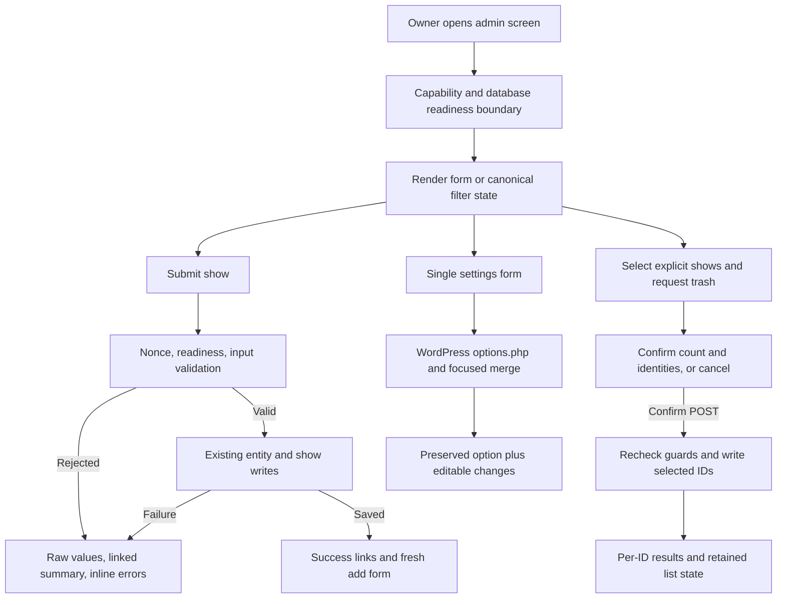

# Phase 03: Administration Workflows - Research

**Researched:** 2026-10-04
**Domain:** Existing WordPress administration forms, lists, settings, and procedural PHP handlers
**Confidence:** MEDIUM — current source was read directly; external guidance comes from primary documentation, with browser interaction still requiring execution evidence.

<user_constraints>
## User Constraints (from CONTEXT.md)

The following decision text is copied verbatim. DATA_Q7A9M2X4_START

### Date/time entry

- **D-01:** Use a date picker for show dates and multi-day end dates, with clearer time dropdowns. Keep time optional and respect the existing configured 12/24-hour format.
- **D-02:** Label the time controls “Time (optional)” and offer “Not specified.” Keep the dropdowns visible; enable minutes once an hour is selected. Preserve the existing meaning and storage of a show without a time.
- **D-03:** Keep the multi-day checkbox. Checking it reveals “End date — last day of the event,” with short help explaining when the show leaves the upcoming list. Preserve the existing expiration behavior.
- **D-04:** Show field-specific error text and a summary that links to the affected fields. Preserve all entered values after invalid submissions so users can correct them.

### Filters and bulk actions

- **D-05:** Remember scope and page size between visits, retaining the existing per-user behavior. Preserve all active choices—scope, artist, tour, venue, sort, and page size—through filtering, sorting, and pagination, and keep their selected values visible. Do not add persistent between-visit preferences for the other filters.
- **D-06:** “Reset filters” clears artist, tour, and venue only. Keep the current scope, sort order, and page size, and return to page 1.
- **D-07:** Before moving selected shows to trash, confirm the action with the explicitly selected count and offer Confirm or Cancel. Only explicitly selected shows may be affected.
- **D-08:** Report bulk outcomes with counts and actionable details, including an explanation for each failure. Keep the current filters and sort order after the action.

### Settings organization

- **D-09:** Keep settings on one page with clear section headings, “Jump to section” links, and one Save changes action.
- **D-10:** Use six focused groups: Display & formatting; Show labels & links; Related posts; Feeds; Permissions; Advanced.
- **D-11:** Provide short inline explanations, normally one or two sentences where a setting needs explanation. Include examples for formats and links to longer guidance where useful.
- **D-12:** Keep Advanced visible immediately, using the same layout as other sections and a jump link. Do not collapse it by default.
- **D-13:** Reorganization must retain existing option keys, saved values, and setting meanings, including hidden, unknown, and falsey settings preserved by Phase 02.

### Errors and accessibility

- **D-14:** After successfully adding a show, stay on the add-show screen. Show a clear success message, offer links to edit the saved show or view the list, and prepare the form for another show. Preserve existing create/edit/copy identity behavior.
- **D-15:** If a system problem blocks saving, explain the reason in plain language and provide a next step available in the existing workflow. Preserve entered values for correction or retry. Do not invent a new repair workflow.
- **D-16:** Require confirmation for moving an individual show to trash too. Identify the show and offer Confirm or Cancel, consistent with bulk trash actions.
- **D-17:** When filters produce no matching shows, explain “No shows match these filters” and offer Reset filters using D-06's behavior.
- **D-18:** Changed controls must have associated labels, semantic table headings where applicable, keyboard operation, and text-based success/error feedback. Preserve existing capability checks, nonce checks, and readiness guards while changing forms and confirmation flows.

### Agent's Discretion

The user explicitly selected each decision above; no area was delegated wholesale. Exact copy beyond the agreed labels, spacing, mapping existing settings into the six groups, focus/announcement mechanics, and the implementation of accessible confirmations are normal implementation details. Follow the existing WordPress administration patterns and the locked accessibility/preservation requirements.

DATA_Q7A9M2X4_END

### Deferred Ideas (OUT OF SCOPE)

DATA_N8D4B6K1_START
None — discussion stayed within phase scope. Existing public-publishing and CSV migration integration checks remain assigned to Phases 04/05 in the roadmap.
DATA_N8D4B6K1_END
</user_constraints>

## Project Constraints (from AGENTS.md)

The user supplied the project instructions; a root AGENTS.md was not present when read. The supplied directives are: read `/Users/davidzenz/.codex/RTK.md`; prefix every shell command with `rtk`; use Default mode for planning/execution; use Plan mode for discussion choices, or numbered plain-text questions in Default mode unless `--auto`. [VERIFIED: user-supplied AGENTS.md instructions; /Users/davidzenz/.codex/RTK.md:1-25]

This research owns only this document. Parent handles commits; no production changes, tests, or branch operations were performed. The configured workflow enables validation and security: verbatim values `"nyquist_validation": true`, `"security_enforcement": true`, `"security_asvs_level": 1`. [VERIFIED: .planning/config.json:24-49]

<phase_requirements>
## Phase Requirements

| ID | Description | Research Support |
|----|-------------|------------------|
| ADMIN-01 | Add and edit show forms make date, optional time, multi-day, and expiration fields clear; invalid values receive field-specific text feedback and all entered values remain available for correction. | Lossless submitted-state model, native picker with raw-date fallback, server validation, time sentinel preservation, accurate save outcome. |
| ADMIN-02 | Show-list filters for scope, artist, tour, venue, sort, and page size remain visible after filtering and pagination; bulk actions identify their result and do not affect unselected shows. | Canonical request state, narrow reset URL, selected-ID POST confirmation, per-record outcome accounting. |
| ADMIN-03 | Settings are grouped with contextual help while retaining existing option keys, saved values, and setting meanings. | Six section mapping plus protected option merge at the actual save boundary. |
| UX-01 | Administration controls changed for this delivery have associated labels, semantic table headings where applicable, keyboard operation, and text-based success and error feedback. | Labels/fieldsets, linked errors, keyboard confirmation page, focus and text notices, manual browser acceptance. |

Descriptions copied from REQUIREMENTS.md; these four requirement IDs are verbatim. [VERIFIED: .planning/REQUIREMENTS.md:27-31,40]
</phase_requirements>

## Summary

Use the existing procedural, server-rendered WordPress administration. Source loads the current form, list, settings, and handlers through the plugin bootstrap; it already enqueues WordPress jQuery and its admin script. Preserve that integration and the custom data model. [VERIFIED: gigpress.php:60-67,122-126]

Plan three coherent delivery slices: show entry and feedback; list navigation and selected trash confirmation; settings grouping and save preservation. Integrate accessibility within each slice. Current source has gaps directly relevant to the locked decisions: rejected submissions coerce relationship selections, list state is fragmented, the bulk handler returns one aggregate outcome, and the options registration has no preservation callback. These are targeted seams to repair, not evidence that Phase 02 migration preservation failed. [VERIFIED: admin/new.php:52-89; admin/shows.php:27-121; admin/handlers.php:358-396; gigpress.php:462-464]

**Primary recommendation:** Keep server authority for validation and mutations, retain raw submitted state independently of normalized database fields, and add a server-rendered confirmation step plus a focused options merge.

## Architectural Responsibility Map

This table prescribes ownership for the implementation, rather than adding a new application tier.

| Capability | Primary Tier | Secondary Tier | Rationale |
|------------|-------------|----------------|-----------|
| Date/time entry and progressive reveal | Browser / Client | WordPress PHP administration | Browser picker/keyboard interaction; server owns raw recovery and validation. |
| Show validation and identity | WordPress PHP administration | Database / Storage | Validate before side effects; keep edit/copy distinction and existing persistence. |
| Filter navigation | WordPress PHP administration | Browser / Client | One normalized request state renders controls, URLs, queries, and return actions. |
| Trash confirmation/results | WordPress PHP administration | Database / Storage | Confirmed explicit IDs and guarded writes determine truthful results. |
| Settings regrouping/save | WordPress Settings API | Database / Storage | One form and save action; current option is the preservation baseline. |
| Feedback/accessibility | WordPress PHP administration | Browser / Client | Server text is available without JS; script adds deliberate focus. |

## Standard Stack

### Core

| Technology | Version / policy | Purpose | Evidence |
|------------|------------------|---------|----------|
| PHP | Retain 8.3+ support floor | Existing handlers and calendar validation | Locked Phase 01/03 constraints; existing `checkdate(...)` use. [VERIFIED: admin/handlers.php:216-219] |
| WordPress | Retain 7.0+ floor; use current compatible patches during execution | Admin forms, nonces, capabilities, Settings API, `$wpdb` | Existing registration and guards. [VERIFIED: gigpress.php:93-102,462-464; admin/handlers.php:247-248] |
| HTML native date control | Living Standard, checked 2026-10-04 | Date picker without extra package | Invalid date values become empty; see fallback pattern below. [CITED: https://html.spec.whatwg.org/multipage/input.html#date-state-(type=date)] |
| WordPress bundled jQuery | Core-provided version; no plugin version pin | Existing admin enhancement | Verbatim `wp_enqueue_script('jquery');` and `array('jquery')`. [VERIFIED: gigpress.php:122-126] |

### Supporting

Use existing WordPress translation/escaping functions, URL builders, and pagination. `add_query_arg()` output must be escaped when emitted as a link. [CITED: https://developer.wordpress.org/reference/functions/add_query_arg/]

### Alternatives Considered

No alternative framework or replacement data model is in scope; this is a locked boundary, not a library selection question. No new external packages are recommended or required. Installation and Package Legitimacy Audit are therefore not applicable. Native controls and WordPress core APIs satisfy the approved implementation direction.

## Architecture Patterns

### System Architecture Diagram



The diagram describes proposed data flow. WordPress owns authentication/session handling; the existing configured capabilities protect menu entry, with a separate settings capability. Verbatim capability seam: `$gpo['user_level']`, `'manage_options'`. [VERIFIED: gigpress.php:93-102]

### Component Responsibilities

| Existing component | Implementation responsibility | Source seam read |
|--------------------|-------------------------------|------------------|
| Add/edit renderer | Lossless raw state, date presentation, errors, add-another form | `gigpress_add()` calls add/update handlers before state recovery. [VERIFIED: admin/new.php:3-16,52-89] |
| Handlers | Shape/calendar/time validation, guarded save result, selected trash results | `gigpress_error_checking`, `gigpress_prepare_show_fields`, add/update/delete functions. [VERIFIED: admin/handlers.php:28-178,198-397] |
| Show list | Normalized filters, reset, visible controls, confirmation page and return state | `gigpress_admin_shows()`. [VERIFIED: admin/shows.php:3-121,148-218] |
| Plugin integration | Existing enqueue, settings registration, shared pagination seam | `register_gigpress_settings()`, `gigpress_admin_pagination(...)`. [VERIFIED: gigpress.php:122-126,408-436,462-464] |
| Settings renderer | Six headings/jump links and labeled fields; one form | `gigpress_settings()`, `settings_fields('gigpress')`. [VERIFIED: admin/settings.php:3-19,215-230] |
| Admin script/style | No forced blur; minute enablement, reveal state, focus, scoped styles | Script calls `this.blur();` on multi-day toggle; CSS error treatment is currently visual. [VERIFIED: scripts/gigpress-admin.js:18-27; css/gigpress-admin.css:36-47] |

### Pattern 1: Lossless request state plus normalized write state

Create one raw form-state representation immediately after unslashing scalar request values; retain strings, checked/radio states, edit identity, and association choices. Only normalize into persistence fields after validation. Separate field errors from system/save outcomes so a failed save never takes the success reset branch. The current renderer uses `sprintf("%02d", ...)` for dates/time and `absint(...)` for relationship choices, losing nonnumeric submissions and the new-entity selections. Verbatim relationship marker `'new'` is recognized by the handlers, whereas renderer recovery uses `$show_artist_id = absint($_POST['show_artist_id']);`, `$show_venue_id = absint($_POST['show_venue_id']);`, `$show_tour_id = absint($_POST['show_tour_id']);`, `$show_related = absint($_POST['show_related']);`. [VERIFIED: admin/new.php:54-89; admin/handlers.php:60-61,80-81,96-98,112-114]

Keep hidden mode/ID strictly separate from copied content: current add mode uses `name="gpaction" value="add"`; update uses `value="update"` with `name="show_id"`; edit/copy are load actions. Return an explicit outcome from handlers instead of relying on any non-null result meaning errors. Capture the inserted show ID immediately for edit/list links. Reset only after confirmed save, using established sticky defaults for the next show. [VERIFIED: admin/new.php:93-99,188-206; admin/handlers.php:163-173,266-293]

Failure retries need particular care: field preparation currently creates artist/venue/tour/related post before writing the show, keeps creation errors locally, and returns only the prepared show. If a related creation succeeds and the show insert fails, carry its newly created identity into the recovered form so retry reuses it; do not recreate it or claim the whole operation rolled back. Surface creation failures and preserve remaining input. This is a focused reliability fix for D-15, without adding a repair product. [VERIFIED: admin/handlers.php:59-177,264-293]

### Pattern 2: Native picker with editable raw-date fallback

Use native date inputs for valid/default dates. Validate scalar shape, exact calendar components, and `checkdate()` on the server; do not use rollover parsing that silently turns an impossible date into another day. PHP `checkdate()` validates Gregorian dates. [CITED: https://www.php.net/manual/en/function.checkdate.php]

A native date input sanitizes invalid values to an empty string. Therefore render rejected/impossible stored or submitted dates as an escaped **editable text fallback** with a format hint, preserving the exact raw string; offer the adjacent picker to replace it. Use one authoritative submitted value per date, with clear precedence if a picker replacement is chosen. No JS must still allow correction. Do not supply an impossible value to `type="date"` and claim preservation. [CITED: https://html.spec.whatwg.org/multipage/input.html#date-state-(type=date)]

Use `novalidate` on the show form if server summaries are the chosen validation path. It bypasses interactive browser validation, allowing server feedback; it does **not** disable date-value sanitization. Native invalid partial typed input may submit an empty value, so browser validation and raw recovery require actual browser coverage. Preserve everything the server receives and use the text fallback for raw values; do not promise recovery of text the browser never exposes. [CITED: https://html.spec.whatwg.org/multipage/form-control-infrastructure.html#attr-fs-novalidate; https://html.spec.whatwg.org/multipage/input.html#date-state-(type=date)]

Retain legacy request components during transition as an adapter where existing harness callers need them. Give a new date request precedence only when explicitly present, then validate it; malformed new input must not silently fall back to legacy/default values. New field names are implementation proposals, not existing contracts. Avoid arbitrary new year ranges, UTC conversions, or an end-date-after-start prohibition: those would change behavior beyond the locked presentation work.

### Pattern 3: Preserve optional time and expiration exactly

Verbatim storage contract: `if($_POST['gp_hh'] == "na") { $show['show_time'] = "00:00:01"; }`; the minute fallback is `($_POST['gp_min'] == "na") ? '00' : ...`; no multi-day means `$show['show_expire'] = $show['show_date'];` and `$show['show_multi'] = 0;`, otherwise `1`. [VERIFIED: admin/handlers.php:36-49]

Keep hour values in their current 24-hour storage domain even when the displayed label is 12-hour AM/PM. The existing renderer selects 24-hour labels when `alternate_clock` is nonempty, otherwise separates AM/PM with stored midnight `"00"` and noon `"12"`. Replace ambiguous labels with explicit AM/PM text. Enable minutes after selecting an hour; when minutes are disabled their POST value is absent, so normalize that path explicitly. Preserve valid non-five-minute values loaded from existing records, either by offering all valid minutes or including the loaded value. [VERIFIED: admin/new.php:243-303,307-329; admin/handlers.php:37-41]

Explain expiration against the current cutoff, not site-local midnight. Verbatim cutoff is `gmdate( 'Y-m-d', ( time() + ( -11 * HOUR_IN_SECONDS ) ) )`; upcoming uses `show_expire >= GIGPRESS_NOW`, past uses `<`. Say the event stays upcoming through its end date using GigPress's existing daily cutoff; do not recalculate that cutoff in the UI. [VERIFIED: gigpress.php:47; admin/shows.php:48-56,133-135]

### Pattern 4: One canonical list-state array

Normalize scope, artist, tour, venue, sort, page size, and page once. Use it for controls, SQL predicates, pagination, scope links, confirmation hidden fields, cancel links, notices, and undo/return URLs. Reset removes only the three entity filters and page, retaining the other active choices. Clamp page after operations or an empty filtered result so no undefined pagination array is consulted.

Verbatim current keys/defaults: `'gigpress_scope'`, `'gigpress_limit'`; scope defaults to `'upcoming'`; page size defaults to `25`; page key is `'gp-page'`; entity keys are `'artist_id'`, `'tour_id'`, `'venue_id'`, with unfiltered value `'-1'`; sizes are `array(10,25,50,100,150,200,250,300)`; sort UI values are `"desc"`, `"asc"`. [VERIFIED: admin/shows.php:35-104,195-205]

**Current-source difference from context:** sort is already persisted as `'gigpress_sort'`, with `'ASC'` fallback, despite D-05 specifying persistence for scope/page size only. Implement sort as request-only state; stop reading/writing that preference for this workflow. Parent confirmed this interpretation of the explicit locked choice. Do not create persistent artist/tour/venue preferences. [VERIFIED: admin/shows.php:59-69; 03-CONTEXT.md:D-05; parent clarification in this research session]

**Current-source bug:** `$limit` is overwritten with `$pagination['offset'].','.$pagination['records_per_page']`, then reused to select the page-size option. Keep an integer page size separate from the SQL offset/limit. Pagination helper returns data only when total pages exceed one, so explicitly handle a single page and zero matches. [VERIFIED: admin/shows.php:108-121,200-205; gigpress.php:408-436]

### Pattern 5: Server-confirmed selected-only trash

Use a server-rendered confirmation page/state in the current admin workflow. Initial selection POST previews normalized, unique, positive selected IDs, explicit count and show identifiers; it does not mutate. Confirm POST carries only that selection and normalized return state, protected by nonce/capability/readiness checks. Cancel returns to the retained list state. Add individual Trash through the same flow with one ID, because the current show row only offers Edit and Copy. This naturally supports keyboard and no-JS operation. [VERIFIED: admin/shows.php:216-218,257-266; admin/handlers.php:363-383]

Do not infer IDs from a filter query, checked header, current page, or missing selection. Reject malformed/nested values rather than turning arbitrary text into an unintended positive ID. Treat confirmation as intent, not authorization: recheck configured capability and readiness immediately before mutation; nonces do not substitute for authorization. [CITED: https://developer.wordpress.org/apis/security/nonces/]

Use per-record accounting: distinguish changed, already trashed, missing, failed, and stale/ineligible selections; verify outcomes as needed after zero affected rows. Keep failure identity and reason, with an existing Edit/List link when available. Update only eligible selected IDs; count confirmed changes, not submitted length. Scope undo IDs to successful transitions. A single SQL success cannot explain which records failed, and zero changed rows is not a database error. `wpdb::update()` returns row count or `false`. [CITED: https://developer.wordpress.org/reference/classes/wpdb/update/]

Current trash status and selection contract verbatim: `$_REQUEST['show_id']`, `UPDATE ... SET show_status = 'deleted' WHERE show_id IN($shows)`; undo is built from all submitted IDs before the write. Replace this broad aggregate flow while preserving status-based trash, original row identities/relationships, and existing restore semantics. [VERIFIED: admin/handlers.php:367-395]

### Pattern 6: Single-page settings plus focused merge sanitizer

Keep the form posting to `options.php`, `settings_fields('gigpress')`, and one save control. WordPress settings registration supports `sanitize_callback`; options submission uses its nonce/capability flow. [CITED: https://developer.wordpress.org/reference/functions/register_setting/; https://developer.wordpress.org/plugins/settings/using-settings-api/]

**Current-source difference from preservation expectations:** `register_setting('gigpress','gigpress_settings');` has no callback. Bootstrap fills only missing defaults using `array_key_exists`, but that does not protect a subsequent whole-option form replacement. The hidden welcome value currently does not echo its stored content. The visible form also omits some defaults/unknown keys. Preserve these on the actual save cycle. [VERIFIED: gigpress.php:462-464; admin/db.php:138-145; admin/settings.php:215-226]

Implement a narrowly scoped, idempotent merge callback: begin with the stored option; overlay validated **editable** fields only; preserve unknown/unrendered keys and their types byte-for-byte where serialization allows; preserve hidden coordinator/sticky defaults from stored state rather than trusting POST. Never recursively sanitize/coerce all option values, replace the complete array, or use truthiness to detect missing keys. Explicitly submit/save unchecked states for controlled checkboxes; preserve special nonnumeric checkbox domains. Keep the callback pure because it participates in all updates to the option, including programmatic sticky/default writes—do not interpret absent checkboxes in those programmatic calls as unchecked. Bind any form-specific handling to the actual settings submission or use explicit form zeros instead.

Special domain verbatim: `name="gigpress_settings[country_view]" value="long"`; schema output is `value="y"`/`value="n"`; checkbox flags otherwise use `value="1"`. Preserve an existing unknown radio/select value when untouched instead of default-selecting another value. [VERIFIED: admin/settings.php:178-209]

Recommended group mapping below quotes existing keys verbatim; headings are locked, assignment is implementation discretion. [VERIFIED: admin/settings.php:21-209]

| Group | Existing option keys |
|-------|----------------------|
| Display & formatting | `date_format`, `date_format_long`, `time_format`, `alternate_clock`, `display_country`, `country_view` |
| Show labels & links | `shows_page`, `noupcoming`, `nopast`, `artist_label`, `tour_label`, `external_link_label`, `buy_tickets_label`, `age_restrictions`, `artist_link`, `target_blank` |
| Related posts | `related_position`, `related_heading`, `autocreate_post`, `related_category`, `category_exclude`, `relatedlink_date`, `relatedlink_city`, `relatedlink_notes`, `related` |
| Feeds | `rss_head`, `display_subscriptions`, `rss_title`, `rss_limit` |
| Permissions | `user_level` |
| Advanced | `output_schema_json`, `load_jquery`, `disable_css`, `disable_js` |

Keep unrendered options such as `rss_list`, `sidebar_link`, and sticky defaults in storage without exposing new controls. Those keys exist among defaults, but adding UI for them is not a grouping prerequisite. [VERIFIED: admin/db.php:88-92,106,110-116]

### Accessibility and feedback contract

Add explicit label/control associations for date/hour/minute, each filter, each setting, row selection and select-all. Group related radio/check controls with fieldsets/legends where appropriate. Keep existing table row/column headings; label row selectors by identifying show text, and scope select-all to rendered rows. WAI documents explicit `for`/`id` associations. [CITED: https://www.w3.org/WAI/tutorials/forms/labels/]

Render translated field errors beside inputs, associate error/help IDs with `aria-describedby`, mark invalid controls, and link a summary to each real affected field. Preserve expanding sections containing errors. Focus the linked summary or first error deliberately after a failed submission; after success, focus the success notice or new-form heading. Never force blur when toggling multi-day. Provide concise text notices and correction guidance. [CITED: https://www.w3.org/WAI/tutorials/forms/notifications/]

For blocked saving, explain the failed action and existing next step: retry after a transient database problem, review/correct fields, or ask the site's administrator/support to resolve a paused upgrade before retrying. Preserve submitted state. Avoid exposing database errors in user text and do not link to a nonexistent status/repair screen; Phase 02's advisory suggestion is constrained by D-15's explicit boundary.

### Anti-Patterns to Avoid

- Treating formatted display strings as source input; numeric coercion before errors discards correction data.
- Relying on JS to prevent writes or require confirmation.
- Using submitted count as changed count or allowing an empty selection to mean all filtered records.
- Sharing a variable for page size and SQL limit; rebuilding return URLs separately at every control.
- Applying blanket sanitation to unknown stored options, or trusting hidden version metadata from the browser.
- Clearing POST/resetting the form on a failed DB write; silently recreating already-created related entities on retry.

These are implementation prescriptions derived from the source seams above, not new product policies.

## Don't Hand-Roll

| Problem | Don't Build | Use Instead | Why |
|---------|-------------|-------------|-----|
| Date picking | Custom calendar/framework | Native date input with explicit raw fallback | Approved picker with limited script; native sanitization remains a known boundary. [CITED: https://html.spec.whatwg.org/multipage/input.html#date-state-(type=date)] |
| Options authorization/nonce | New settings endpoint | Existing WordPress Settings API | Retains current flow and supports focused callback. [CITED: https://developer.wordpress.org/plugins/settings/using-settings-api/] |
| CSRF/security tokens | Custom token generator | WordPress nonce plus capability check | Separate protection and authority. [CITED: https://developer.wordpress.org/apis/security/nonces/] |
| Navigation URLs | Concatenated HTML query strings | WordPress query argument helpers and escaped output | Central retained-state construction. [CITED: https://developer.wordpress.org/reference/functions/add_query_arg/] |
| Upgrade repair | New retry/status product | Existing readiness boundary and existing admin/support next step | Explicit D-15 scope. |

## Common Pitfalls

| Pitfall | What goes wrong | Prevention / warning sign |
|---------|-----------------|---------------------------|
| Impossible dates disappear | Native date input normalizes bad values to empty; `novalidate` does not change this. | Editable raw fallback; real browser invalid-date check. [CITED: https://html.spec.whatwg.org/multipage/input.html#date-state-(type=date)] |
| New selections disappear | Error recovery `absint(...)` removes marker `'new'`. | Preserve raw association value and reveal correct fieldset. [VERIFIED: admin/new.php:65-89] |
| No-time becomes midnight | Disabled minutes absent; hour/minute are formatted numerically during errors. | Preserve `"na"` and storage `"00:00:01"`; test true midnight separately. [VERIFIED: admin/new.php:58-59; admin/handlers.php:37-41] |
| Save failure resets input | Add/update unset POST after both success and SQL failure; local related-creation errors are discarded. | Structured outcome and success-only reset; carry created identities on retry. [VERIFIED: admin/handlers.php:175-177,288-294,346-350] |
| No-op update misreported | Current update compares count loosely with `FALSE`. | Use strict error comparison and existing-row check for zero count. [VERIFIED: admin/handlers.php:329-347; CITED: https://developer.wordpress.org/reference/classes/wpdb/update/] |
| Page-size choice disappears | SQL limit replaces selected size; empty/single-page helper returns nothing. | Separate size/offset; calculate safe pagination for all counts. [VERIFIED: admin/shows.php:112-121,200-205; gigpress.php:414-436] |
| Settings disabled flags re-enable | Unchecked checkbox omitted, later bootstrap fills missing defaults. | Explicit unchecked values for controlled form fields and preserving merge. [VERIFIED: admin/settings.php:160-161; admin/db.php:138-145] |
| Hidden settings corrupt metadata | Hidden version/defaults can be changed by crafted POST; welcome hidden input renders empty. | Stored protected baseline; actual options save-cycle coverage. [VERIFIED: admin/settings.php:215-224] |
| Count/undo overclaims | Aggregate trash success hides missing or already-trashed IDs; undo uses submitted IDs. | Per-ID outcomes; undo only actual transitions. [VERIFIED: admin/handlers.php:380-395] |

## Code Examples

These examples are proposed implementation patterns, not functions that already exist. New helper names/IDs are illustrative and should be chosen consistently during implementation.

### Calendar validation without rollover

PHP official signature is `checkdate(int $month, int $day, int $year): bool`. [CITED: https://www.php.net/manual/en/function.checkdate.php]

```php
// Proposed helper: preserve $raw separately for rendering after rejection.
function parse_admin_date($raw) {
    if (!is_string($raw) || !preg_match('/\A([0-9]{4})-([0-9]{2})-([0-9]{2})\z/', $raw, $parts)) {
        return false;
    }
    return checkdate((int) $parts[2], (int) $parts[3], (int) $parts[1]) ? $raw : false;
}
```

The fixed-width input grammar is an implementation recommendation for the current MySQL date contract; it must not alter stored source content merely by rendering it.

### Keep sentinel handling explicit

Quoted source values beside this skeleton: `'gp_hh'`, `'gp_min'`, `"na"`, `"00:00:01"`, `'00'`, and `':00'`. [VERIFIED: admin/handlers.php:37-41]

```php
// After scalar/domain validation; null is an absent disabled-minute control.
$hour = $raw['gp_hh'];
$minute = $raw['gp_min'] ?? null;
$time = $hour === 'na'
    ? '00:00:01'
    : sprintf('%02d:%02d:00', (int) $hour,
        ($minute === null || $minute === 'na') ? 0 : (int) $minute);
```

### Idempotent merge shape

```php
// Proposed pure merge, supplied validated editable keys by the settings boundary.
// Unknown and protected stored values survive without coercion.
$merged = $stored;
foreach ($editableKeys as $key) {
    if (array_key_exists($key, $submitted)) {
        $merged[$key] = validate_editable_value($key, $submitted[$key]);
    }
}
return $merged;
```

The validator here is an illustrative seam to implement, not an existing API. Do not mutate options recursively within the callback. Registration accepts a callable sanitizer. [CITED: https://developer.wordpress.org/reference/functions/register_setting/]

## State of the Art

| Existing approach | Phase approach | Impact |
|-------------------|----------------|--------|
| Separate date dropdowns and visual error wrapper | Native date picking, editable rejected-state fallback, linked server errors | Preserves correction data and adds picker clarity. |
| Direct bulk mutation with generic notice | Confirmation POST followed by per-ID outcomes | Makes explicit selection and partial results reviewable. |
| Flat options table with hidden preservation fields | Six sections, one save, protected merge baseline | Preserves settings beyond fields rendered by the form. |

These are phase implementation recommendations, not claims of industry deprecation. No new stack/version upgrade is required.

## Assumptions Log

No product decision based on training-only knowledge is introduced. Browser-specific behavior and execution timings remain open validation questions rather than locked assumptions. Proposed helper/request names and layouts are explicitly implementation sketches.

## Open Questions (RESOLVED)

Resolution here records the implementation choices selected by the existing plans, not observed execution outcomes. All three planning questions are resolved; their execution acceptance remains **PENDING** in `03-VALIDATION.md`. No browser, no-JS, HTTP or runtime result is established by this status update.

1. **Browser date interaction** — RESOLVED: Tasks `03-01-02` and `03-01-03` select native date controls for valid/default values and an escaped editable text fallback for invalid received or stored values, per D-01, D-04 and D-18. The authoritative date key remains editable; an adjacent replacement picker takes precedence only through its explicit replacement checkbox, including without JS. Task `03-04-02` separates actual native-picker, incomplete-input, focus, keyboard and disabled-JS observations from PHP/HTTP assertions. **Execution acceptance: PENDING** — observe incomplete typed UI text and what the browser actually submits, picker/fallback focus, invalid POST correction and keyboard/no-JS use. HTML specifies value sanitization; this resolution does not claim recovery of input the browser never exposes to the server. [CITED: https://html.spec.whatwg.org/multipage/input.html#date-state-(type=date)]
2. **System failure recovery** — RESOLVED: Task `03-01-02` selects explicit save/recovery outcomes with raw state, field/system errors and completed `created_ids`, per D-04 and D-15. Validate before side effects, stop and report failed substeps, and carry completed artist/venue/tour/post IDs into recovered selections while retaining entered creation text and other controls, so retry reuses completed creations. Current preparation has related-entity side effects; this selected approach does not promise atomic rollback or introduce a repair workflow. **Execution acceptance: PENDING** — the task's controlled-failure, snapshot and read-back checks must establish retained values, accurate failed-substep feedback and retry without duplicate creation; supported runtime evidence remains assigned to `03-04-03`. [VERIFIED: admin/handlers.php:59-177]
3. **Validation transport** — RESOLVED: Task `03-04-01` selects a temporary authorized disposable HTTP fixture by extending the existing runner with `browser-fixture`, a loopback-only dynamically assigned port override, synthetic users/data and private owned-session metadata. Real WordPress login/cookies and rendered nonces drive form submissions, with independent database read-back; smoke cleanup and documented start/status/stop govern fixture lifecycle. Task `03-04-02` expands real HTTP settings/guard checks and records actual browser observations separately, with final owned-session cleanup and explicit pending human checks for unobserved interactions. The current callback runner still has no published browser endpoint. **Execution acceptance: PENDING** — create and observe the transport, authentication, save/guard assertions, browser/no-JS interactions and cleanup; runtime matrices and measured timing remain assigned to `03-04-03`. No real site data is required or exposed by the selected fixture design. [VERIFIED: tests/compat/run.sh:799-832; tests/compat/compose.yaml:17-38]

## Environment Availability

Probed without running tests: Docker `29.4.0`, Compose `v5.1.2`, context `orbstack`, Node `v26.10.0`, jq `jq-1.7.1-apple`. Docker daemon probe returned verbatim `permission denied while trying to connect to the docker API at unix:///Users/davidzenz/.orbstack/run/docker.sock`. No service availability observation was obtained. [VERIFIED: tool outputs in this research session]

| Dependency | Required By | Availability | Fallback / planner action |
|------------|-------------|--------------|---------------------------|
| Docker/OrbStack Compose | Real WordPress/PHP validation | CLI installed; daemon access blocked in this sandbox | Authorized execution context must access the existing runtime; do not replace with fake WordPress APIs. |
| Host PHP | None | Command lookup did not return it | Existing runner executes PHP inside official WordPress containers. [VERIFIED: tests/compat/run.sh:1-3,107-113] |
| Node/jq | Existing runner/evidence tools | Available as above | Retain repository tools. |
| Context7 | Documentation lookup | No MCP tool exposed; CLI lookup returned no executable | Official web documentation was used. |
| Browser fixture | UX interaction acceptance | Current Compose has no published ports; runner has teardown | Add an isolated execution fixture or document human browser procedure. [VERIFIED: tests/compat/compose.yaml:17-38; tests/compat/run.sh:804-810] |

No additional install dependency is recommended. Runtime access and browser fixture are execution prerequisites, not reasons to block planning.

## Validation Architecture

### Test Framework

The existing harness uses real WordPress with PHP callbacks/assertions and disposable MariaDB, not a new JS/unit framework. Existing fixture request helper sets GET/POST/REQUEST and nonce, then invokes the real handler; lifecycle helper still constructs legacy date components. Preserve/update its adapter deliberately when date fields change. [VERIFIED: tests/compat/upgrade-preservation-crud.php:4-14,48-65]

| Property | Value |
|----------|-------|
| Framework | Repository OrbStack/Compose real WordPress harness; no framework installation proposed |
| Config | Existing Compose service definition; PHP is container-owned |
| Existing quick regression | `rtk proxy bash tests/compat/run.sh cell --wp 7.1.2 --php 8.3 --scenario upgrade-preservation --case show-lifecycle` |
| Existing full preservation | `rtk proxy bash tests/compat/run.sh matrix --wp-lines 7.0,7.1 --php-supported upstream --wp-patches latest --php-min 8.3 --scenario upgrade-preservation --case all --error-reporting E_ALL` |
| Existing compatibility smoke | `rtk proxy bash tests/compat/run.sh cell --wp 7.1.2 --php 8.3 --scenario full-workflows` |
| Syntax strategy | Existing `lint --php-branches ... --files ...` runner for changed tracked PHP; resolve supported branches during execution |

The exact existing dispatch values are verbatim `cell`, `matrix`, `lint`, `--wp`, `--php`, `--scenario`, `--case`, `upgrade-preservation`, `show-lifecycle`, `all`, `full-workflows`, `--wp-lines`, `--php-supported`, `upstream`, `--wp-patches`, `latest`, `--php-min`, `8.3`, `--error-reporting`, `E_ALL`. [VERIFIED: tests/compat/run.sh:80-113,421-459,739-790]

The explicit patch example `7.1.2` is existing recorded evidence, not a newly verified latest-release claim; resolve current patches before the phase gate. Phase 02 recorded WordPress `7.0.6`/`7.1.2` and PHP `8.3.35`/`8.4.26`/`8.5.11`. [VERIFIED: .planning/phases/02-data-and-upgrade-preservation/02-VERIFICATION.md:61,78]

Cold Compose commands can pull images/start services and cannot be asserted to finish within 30 seconds. A warm single-case PHP invocation is the future quick sampler; measure it during execution. No new administration-workflow case or browser command exists yet: the accepted scenario allowlist is verbatim `activation-menu|admin-menu|csv-roundtrip|full-workflows`, plus `upgrade-preservation`. Extend the runner and fail-closed assertion/result plumbing before assigning a runnable new command. [VERIFIED: tests/compat/run.sh:787-790,832-866]

### Phase Requirements → Test Map

| Req ID | Behavior | Test Type | Runnable strategy / current coverage | Gap |
|--------|----------|-----------|---------------------------------------|-----|
| ADMIN-01 | Valid/invalid start/end dates, optional time, all fields recovered; successful add stays ready for next show | Real WP integration + browser | Existing show-lifecycle command above protects identity; extend harness for rendering/rejected save state | New phase assertions required |
| ADMIN-02 | Filter state survives all URLs; reset clears only entities; selected-only confirm/cancel/trash and partial results | Real WP integration + browser | Existing show-lifecycle protects selected mutation baseline; add list rendering and confirmation requests | New phase assertions required |
| ADMIN-03 | All six groups, one save; unchanged hidden/unknown/falsey values survive real option update/reload | Real WP options integration + browser | Existing full preservation checks bootstrap settings; add actual settings submission/callback checks | Save-cycle gap |
| UX-01 | Explicit labels/headings, keyboard focus, readable errors/notices, no-JS confirmation | Rendered markup + human browser | PHP render assertions can check associations/text; keyboard/screen-reader/picker checks manual | Browser procedure required |

### Sampling Rate

- Per task: changed-file PHP lint and warm relevant integration case after it exists; browser check for each changed interactive surface.
- Per wave: relevant existing lifecycle/preservation regression plus new administration assertions.
- Phase gate: supported runtime matrix, guarded mutation negative checks, actual settings save/reload, and recorded browser acceptance; report coverage/timings truthfully.

### Wave 0 Gaps

- Add focused Phase 03 behavior coverage to the existing probe/runner rather than introducing a test framework. Proposed filenames/case names must be marked NEW in plans.
- Add invalid raw date, impossible stored date, legacy-component request and native date request fixtures; both no-time and midnight; arbitrary existing minute; multi-day off/on.
- Cover rejected association marker state, notes and related-post radio state, edit identity, copy source immutability, zero-row update, blocked readiness, failed show write after related creation, safe retry.
- Cover all filter/sort/page combinations, zero rows and last-page deletion, scope/page-size preference lifetime, request-only sort, no-selection/duplicates/invalid IDs, confirmation cancel and bypass attempts, partial DB failure, unchanged unselected rows, truthful undo.
- Cover real options update/reload with unknown scalar/nested values, false/zero/empty values, protected hidden metadata/sticky keys, unchecked controls, unknown untouched radio/select values, unchanged meaning and exact keys.
- Provide disposable browser access and documented keyboard/focus/no-JS checks. PHP callback probes alone cannot prove browser behavior.

## Security Domain

Security is explicitly enabled at level `1`; apply controls to the changed administration paths. Verbatim configuration: `"security_enforcement": true`, `"security_asvs_level": 1`. [VERIFIED: .planning/config.json:48-49]

### Applicable ASVS Categories

Use ASVS 5.0 category names, not the older numbering in the generic research template. OWASP's 5.0 index identifies V1 encoding/sanitization, V2 validation/business logic, V6 authentication, V7 session management, V8 authorization, and V11 cryptography. [CITED: https://cheatsheetseries.owasp.org/IndexASVS.html]

| ASVS 5.0 Category | Applies | Standard Control |
|-------------------|---------|------------------|
| V1 Encoding and Sanitization | Yes | Destination-specific escaping for input values, textarea, URLs, translated notices/details; parameterized numeric SQL. |
| V2 Validation and Business Logic | Yes | Scalar/domain validation, canonical date parsing, explicit selection and confirmation, readiness gating, accurate outcomes. |
| V6 Authentication | Inherited | WordPress login; do not add plugin authentication. |
| V7 Session Management | Inherited | WordPress session/cookies and existing nonce handling. |
| V8 Authorization | Yes | Configured GigPress capability on changed show mutations; separate settings capability; checks again on Confirm. |
| V11 Cryptography | No new cryptography | Reuse WordPress nonce machinery; no custom tokens/encryption. |

The current source menu capability and nonce/readiness values are verbatim `$gpo['user_level']`, `'manage_options'`, `check_admin_referer('gigpress-action');`, `gigpress_require_database_ready()`. Handler-level capability checks should accompany any newly exposed confirmation/mutation endpoint; do not assume possession of the nonce is authority. [VERIFIED: gigpress.php:93-102; admin/handlers.php:247-248,363-365; CITED: https://developer.wordpress.org/apis/security/nonces/]

### Known Threat Patterns for This Stack

| Pattern | STRIDE | Mitigation prescription |
|---------|--------|-------------------------|
| Forged confirmation or permission bypass | Spoofing / Elevation | Capability, nonce, readiness and selected-ID shape checks at mutation boundary. |
| Crafted filter/ID/status input | Tampering | Allowlisted request domains, prepared ID predicates, no user-controlled SQL fragment. |
| Hostile recovered values/notices | Tampering | Escape output for HTML attribute/text/textarea/URL destination. |
| Protected option key tampering | Tampering | Stored baseline plus editable-key overlay; do not trust hidden coordinator keys. |
| False partial success/undo | Repudiation | Per-ID outcome/read-back and undo only verified transitions. |

These are planning controls, not a claim of full ASVS conformance or a new compliance obligation.

## Sources

### Primary — repository and official documentation

- Current source read directly: add/edit renderer, handlers, show list, settings, defaults/bootstrap, enqueues/pagination, admin JS/CSS, and real WordPress harness. Citations above give the precise lines used.
- [WHATWG date input](https://html.spec.whatwg.org/multipage/input.html#date-state-(type=date)) — invalid-value sanitization and date domain; living standard page reports updated 2026-10-04.
- [WHATWG validation](https://html.spec.whatwg.org/multipage/form-control-infrastructure.html#attr-fs-novalidate) — submission validation bypass.
- [WordPress register_setting](https://developer.wordpress.org/reference/functions/register_setting/) and [Settings API](https://developer.wordpress.org/plugins/settings/using-settings-api/) — settings boundary and sanitizer support.
- [WordPress nonces](https://developer.wordpress.org/apis/security/nonces/) — CSRF, capability separation; page reports last updated 2026-07-23.
- [WordPress update](https://developer.wordpress.org/reference/classes/wpdb/update/) — affected-row versus false result; [URL builder](https://developer.wordpress.org/reference/functions/add_query_arg/) — escaped generated links.
- [W3C WAI notifications](https://www.w3.org/WAI/tutorials/forms/notifications/) and [labels](https://www.w3.org/WAI/tutorials/forms/labels/) — errors, associations, feedback and focus.
- [PHP checkdate](https://www.php.net/manual/en/function.checkdate.php) — calendar validation.
- [OWASP ASVS 5.0 index](https://cheatsheetseries.owasp.org/IndexASVS.html) — applicable current categories.

### Research seam and limitations

The research-plan seam selected Context7 for HTML/WordPress/WAI and websearch for OWASP. Context7 MCP/CLI were unavailable, so official web sources were fetched as fallback. The classify-confidence seam returned `MEDIUM` for verified websearch (also Context7/ref); browser behavior remains untested. Cache writes were attempted but returned `EPERM` for the global research-cache directory outside writable roots; source digests and findings remain in this document. Graphify status returned disabled. No package installation, test execution, or production changes were needed.

## Metadata

**Confidence breakdown:**
- Standard stack: MEDIUM — retained source integration and locked support floor; no new package/version claim.
- Architecture: MEDIUM — source-grounded seams and official API contracts; implementation sketches require execution evidence.
- Pitfalls: MEDIUM — direct source evidence and normative date behavior; actual browser acceptance outstanding.

**Research date:** 2026-10-04
**Valid until:** Recheck runtime patches/environment during execution; these retained admin patterns are suitable for planning for the next 30 days.
**Commit:** Parent orchestrator handles documentation commit.
