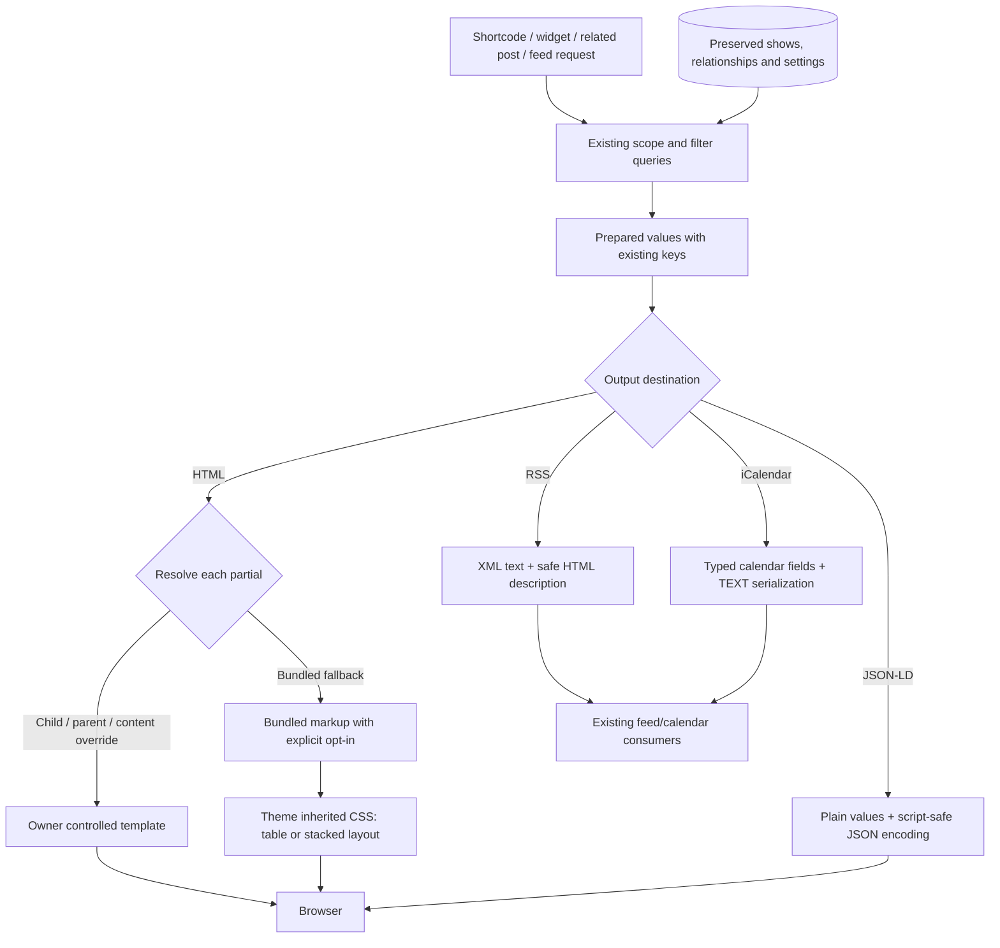

# Phase 04: Public Publishing - Research

**Researched:** 2026-10-05
**Domain:** Procedural WordPress publishing, responsive PHP templates, RSS/XML, iCalendar and JSON-LD
**Confidence:** MEDIUM — official documentation fetched; current source read; no runtime tests or browser acceptance performed during research.

<user_constraints>
## User Constraints (from CONTEXT.md)

The following decision text is copied verbatim from the phase context. [VERIFIED: .planning/phases/04-public-publishing/04-CONTEXT.md:20-50,123-125]

<!-- DATA_F7Q2M9LX_START -->
### Locked Decisions

### Phone layout

- **D-01:** On narrow screens, stack each show into a labelled block: date first, then artist, location and details. Retain the main table on wider screens. Meet the roadmap's 320 CSS-pixel readability requirement without page-level horizontal scrolling.
- **D-02:** Show all available additional information immediately: time, admission, address, notes and links wrap beneath the main information. Do not introduce a Show details disclosure or hide secondary information in the bundled phone layout.
- **D-03:** Keep artist/tour group headings above their shows and preserve existing grouping and order. Do not repeat group context in every show block solely for the phone layout.
- **D-04:** Separate stacked shows with subtle dividers and comfortable spacing, fitting the existing listing rather than introducing bordered cards or a dense presentation.

### Details and status

- **D-05:** Combine clear Cancelled/Sold out text with prominent badges and fully readable show details. The user explicitly confirmed the combined choice after initially replying 1-2. Preserve established status visibility and ticket-link rules; badges are presentation, not a new filtering policy.
- **D-06:** When start time is unspecified, omit the public time line. Preserve the existing distinction between unspecified time and actual midnight.
- **D-07:** Display multi-day dates as one start – end range using the site's saved date format. Preserve stored dates, formatting settings and expiration behavior.
- **D-08:** Present available ticket actions as clearly labelled, emphasized links within the show details. Keep the saved ticket label and destination; do not switch to button-style actions.

### Calendar links

- **D-09:** Show both existing Google Calendar and per-show iCalendar links directly where existing display rules provide them. These actions must be usable by keyboard and with JavaScript disabled; the bundled listing must not require the former Add toggle to reveal them.
- **D-10:** Use the bundled action labels Add to Google Calendar and Download iCalendar.
- **D-11:** Place per-show calendar actions beside the date and time, higher in the listing. At narrow widths the actions may wrap within that date/time area while remaining visible and readable.
- **D-12:** Keep the existing RSS/iCalendar subscriptions below the listing as a compact Subscribe group that wraps when needed. Preserve current enable/disable settings, endpoints and artist/tour/venue filtering; this does not add new subscription behavior.

### Theme styling and customization

- **D-13:** Inherit the theme's fonts and link colors. Add only the spacing, dividers and status treatment needed for clarity; do not introduce a self-contained GigPress typography/color system.
- **D-14:** Apply the new phone layout to bundled templates. Existing custom templates remain under the site owner's control; provide guidance for adopting the new styling. Preserve filenames, variables, CSS hooks and override priority. Retaining a class hook must not automatically force the new stacked layout onto a custom template.
- **D-15:** Use the width supplied by the theme's content area, including narrower widget areas. Do not add a plugin-defined maximum width.
- **D-16:** Keep widgets and related-show displays compact, improving wrapping and status readability where needed. Do not restyle them as replicas of the main stacked listing.

### Agent's Discretion

The user selected all four areas and explicitly chose every decision above. No entire area was delegated. Responsive thresholds, precise spacing/badge treatment, markup and semantics, isolation of bundled responsive styles while retaining existing hooks, safe destination encoding, feed serialization, fixture organization and adoption-documentation placement are implementation details for research/planning. Preserve the locked output, data and customization boundaries. Creating this context does not authorize automatic planning or execution.

### Deferred Ideas (OUT OF SCOPE)

None introduced — the discussion stayed within Phase 04 scope. Existing CSV/conversion fixes and migrated CSV acceptance remain required Phase 05 work; they are prior roadmap assignments rather than new discussion requests.
<!-- DATA_F7Q2M9LX_END -->
</user_constraints>

## Project Constraints (from AGENTS.md)

The supplied project instructions require every shell command to use RTK and require Default mode for planning/execution. Discussion choice capture uses Plan mode, or numbered text questions with answers awaited in Default mode unless explicitly automatic. The referenced RTK rule is: `Always prefix shell commands with rtk.` [VERIFIED: /Users/davidzenz/.codex/RTK.md:5-9; user-supplied AGENTS.md instructions]

Discovery found no on-disk root AGENTS.md/CLAUDE.md, configured `.claude/CLAUDE.md`, or project skill index in the checked locations; this is a session discovery observation, not a claim about other machines. The configured skill map is `"agent_skills": {}` and workflow settings include `"nyquist_validation": true`, `"security_enforcement": true`, `"security_asvs_level": 1`. [VERIFIED: .planning/config.json:24,48-49,61-62]

Research assignment boundaries: write this document only; no source changes, tests, commits or shared tracking updates. The phase is an MVP with a tracer first. This research does not authorize execution. [CITED: orchestrator assignment]

## Summary

Use the existing PHP callbacks, overridable partials and public stylesheet. The resolver already implements child-theme → parent-theme → content override → bundled fallback independently for each partial; its decisive expressions are `get_stylesheet_directory() . '/gigpress-templates/' . $path . '.php'`, `get_template_directory() . '/gigpress-templates/' . $path . '.php'`, `WP_CONTENT_DIR . '/gigpress-templates/' . $path . '.php'`, and `WP_PLUGIN_DIR . '/gigpress/templates/' . $path . '.php'`. Preserve this resolver and all caller variables; add explicit bundled opt-in markup for responsive presentation. [VERIFIED: gigpress.php:174-192]

Prior acceptance explicitly leaves `"Public shortcode, RSS/iCalendar, and CSV import/export workflows were not run against the same upgraded legacy fixture."` for later phases. Phase 04 must render its public surfaces and feeds on populated migrated data, while CSV remains Phase 05. Current fresh-workflow checks only look for strings such as `'<rss '` and `'BEGIN:VEVENT'`; they neither parse feed values nor measure a browser layout. [VERIFIED: .planning/phases/02-data-and-upgrade-preservation/02-VERIFICATION.md:39-42,79-88; tests/compat/probe.php:852-868]

**Primary recommendation:** Build a thin migrated publishing tracer first, adapt only bundled presentation while retaining the template API, then complete destination-specific serializers and public/override coverage, ending with pinned runtime evidence and actual 320 CSS-pixel, keyboard and disabled-JavaScript observations. This ordering follows the phase MVP/tracer assignment and locked preservation requirements. [CITED: orchestrator assignment; .planning/phases/04-public-publishing/04-CONTEXT.md]

## Architectural Responsibility Map

This is the recommended allocation for this phase, derived from the existing server-rendered flow and locked decisions. [VERIFIED: gigpress.php:227-340; output/gigpress_shows.php:133-214; output/feed.php:3-24; output/ical.php:3-28]

| Capability | Primary Tier | Secondary Tier | Rationale |
|---|---|---|---|
| Scope, entity filters, ordering, expired/deleted exclusion | API / Backend (WordPress callbacks) | Database / Storage | Retain existing queries and stored meanings; presentation must not decide membership. |
| Template priority and public partial variable contracts | Frontend Server (PHP rendering) | Theme / content override files | Each include resolves its own partial in the existing caller scope. |
| Wide table, stacked labelled shows, visible calendar actions | Browser / Client (CSS and semantic HTML) | Frontend Server | Emit all links/details server-side; CSS handles layout and wrapping. |
| Widget and related-show compact output | Frontend Server | Browser / Client | Preserve their own list markup and improve limited wrapping/status treatment. |
| RSS, iCalendar and script-safe JSON-LD | API / Backend | Native WordPress/PHP encoders | Encoding belongs at the destination boundary. |
| Migrated fixture preservation | Database / Storage in owned test runtime | Backend probe | Verify migration first, then publish from that same populated database. |
| Readability, no horizontal scroll, focus and no-JS usability | Browser / Client evidence | Manual observations | HTTP and PHP checks cannot establish computed layout or interaction. |

<phase_requirements>
## Phase Requirements

Descriptions are copied from requirements; the IDs are `PUB-01` and `PUB-02`. [VERIFIED: .planning/REQUIREMENTS.md:23-26]

| ID | Description | Research Support |
|---|---|---|
| PUB-01 | Existing shortcodes, widgets, related-post displays, RSS and iCalendar feeds, and their established output contracts continue to work after the update. | Migrated tracer, prepared-value contract, exact show membership/order, XML/ICS/JSON-LD parsing, widget/related entry points and unchanged storage snapshots. |
| PUB-02 | The bundled public show listing remains readable at a 320 CSS-pixel viewport without page-level horizontal scrolling, with existing show details and links available; child-theme, parent-theme, and `wp-content/gigpress-templates` overrides continue to resolve with their current filenames, variables, and CSS hooks. | Bundled opt-in isolation including mixed partials; preserved resolver/variables/hooks; real browser dimensions and readability; override fixtures/adoption guidance. |
</phase_requirements>

## Standard Stack

### Core

| Technology | Version / policy | Purpose | Evidence |
|---|---|---|---|
| WordPress native shortcode, widget, feed, escaping and option APIs | Minimum 7.0; validate latest patches in supported 7.0/7.1 lines | Existing procedural integration and output safety | Header: `Requires at least: 7.0`; registrations include `add_shortcode('gigpress_shows','gigpress_shows')` and `add_feed('gigpress-ical','gigpress_ical')`. [VERIFIED: gigpress.php:10-11,398-405,737-741] |
| PHP native formatting/JSON plus WordPress wrappers | Minimum 8.3; resolve supported newer branches at validation time | Keep current execution model; encode output without added packages | Header: `Requires PHP: 8.3`; runner accepts `--php-supported upstream` and minimum `8.3`. [VERIFIED: gigpress.php:10-11; tests/compat/run.sh:516-525] |
| CSS and server-emitted HTML | Existing bundled stylesheet; no UI framework | Wide table and narrow show blocks with visible details | Existing `<table class="gigpress-table <?php echo $scope; ?>" cellspacing="0">` and two-row show body. [VERIFIED: templates/shows-list-start.php:23-35; templates/shows-list.php:12-98] |

### Supporting

| Existing support | Version / contract | Use |
|---|---|---|
| WordPress jQuery dependency | Supplied by WordPress; no separately pinned package | Keep existing month/year navigation and custom-template toggle behavior. `wp_enqueue_script('gigpress-js', ... array('jquery'))` is gated by `disable_js`; bundled calendar links should work independently. [VERIFIED: gigpress.php:137-145; scripts/gigpress.js:5-14] |
| OrbStack Docker/Compose + MariaDB | Runner-selected official WordPress images; existing DB image `mariadb:11.4.5` | Real WordPress/PHP fixture and matrix execution, not host PHP. [VERIFIED: tests/compat/compose.yaml:1-18] |
| WordPress `esc_xml`, `wp_json_encode`, KSES and URL helpers | Core API, no external install | Use destination-appropriate helpers; `wp_json_encode` accepts encoding flags and can return false. [CITED: https://developer.wordpress.org/reference/functions/wp_json_encode/; https://developer.wordpress.org/apis/security/escaping/] |

**Installation / Package Legitimacy Audit:** No new packages are recommended or required. Keep existing runtime and browser/manual tooling. There is no registry installation to audit, and no package latest-version claim is made. A later plan adding packages must perform the legitimacy gate first. [CITED: phase boundary and D-13/D-16; orchestrator no-new-framework/provider constraint]

**Alternatives:** No alternate framework, calendar provider or replacement template system is in scope. Use the locked stack and current integration. [CITED: .planning/phases/04-public-publishing/04-CONTEXT.md:5-13]

## Architecture Patterns

### System Architecture Diagram

Proposed phase flow, grounded in the current callback/preparation/include sequence. [VERIFIED: output/gigpress_shows.php:16-37,157-214,238-276; output/gigpress_related.php:32-49; output/feed.php:16-24; output/ical.php:21-28]



### Component Responsibilities

The table maps inspected implementation to recommended changes; named NEW artifacts below are proposals requiring creation, not existing infrastructure. Existing include names are quoted verbatim beside their source citations. [VERIFIED: output/gigpress_shows.php:177-199,208-214; output/gigpress_sidebar.php:285-313; output/gigpress_related.php:44-45]

| Inspected component | Plan responsibility |
|---|---|
| Main callbacks and `include gigpress_template('shows-list-start')`, `include gigpress_template('shows-list')`, `include gigpress_template('shows-list-footer')` | Retain query/group behavior and caller scope; characterize all resolved participating partials before opting into bundled layout. |
| Bundled main table/start/show/footer/heading partials | Keep existing hooks and wide table; add actual labels and direct calendar links near date/time; preserve dynamic columns and single date range. |
| Public CSS and legacy script | Scope responsive, direct calendar, subscription and cancelled-detail overrides to explicit bundled opt-in; leave legacy toggle support available to owner templates. |
| `gigpress_prepare()` | Retain prepared keys and fragment meanings for custom templates; produce safe HTML fragments and provide raw/plain machine-output values without repurposing existing keys. |
| RSS/iCalendar handlers | Preserve endpoints, limits, filters, membership and identifiers; serialize correctly for each format. |
| `include gigpress_template('sidebar-list')`, `include gigpress_template('related')` | Compact wrapping/status readability, no main-list replica. |
| Existing compat runner/probe/migration helpers | Add NEW public scenario/module, case aggregation and parsed-value evidence using the same migrated fixture. |
| NEW public browser fixture/evidence instructions | Reuse owned loopback runtime and cleanup conventions; seed public pages and overrides, not merely admin pages. |

### Pattern 1: Preserve the template API; opt into bundled presentation explicitly

**Current contract:** `$cols = 3`, adding an artist column for ungrouped multiple artists and a country column when configured. Show partials consume `$showdata`, `$class`, `$artist`, `$group_artists`, `$total_artists`, `$scope`, `$cols`, `$gpo`; source usages include `$showdata['date']`, `$showdata['end_date']`, `$showdata['artist']`, `$showdata['country']`, `$showdata['gcal']`, `$showdata['ical']`. Keep these variables available in the same include scope. [VERIFIED: templates/shows-list-start.php:14-34; templates/shows-list.php:14-57,84-94]

**Implementation recommendation:** Keep the native wide table and existing classes. Add a new bundled marker only when the structural main-list partial set resolves to bundled files; if any owner partial participates, retain owner-controlled layout unless that template explicitly opts in. Add labels as real HTML text, with intentional accessible reading order; avoid relying solely on generated CSS labels. Handle footer, headings and compact surfaces with their own explicit opt-in where independently overridden. These details implement D-01/D-14; marker names and exact thresholds are new implementation choices, not source constants. [CITED: phase context D-01/D-14]

**Mixed overrides matter:** Resolution is per `$path`, not per whole listing. A custom show body can coexist with a bundled table start, or vice versa. A marker emitted unconditionally by only the bundled start would still apply stacked rules to owner show rows. Characterize complete and partial overrides before CSS work. [VERIFIED: gigpress.php:174-192; output/gigpress_shows.php:177-199]

**Existing hooks to preserve:** `gigpress-table`, `gigpress-header`, `gigpress-row`, `gigpress-info`, `gigpress-date`, `gigpress-artist`, `gigpress-city`, `gigpress-venue`, `gigpress-country`, `gigpress-links-cell`, `gigpress-calendar-add`, `gigpress-calendar-links`, `gigpress-calendar-links-inner`, `gigpress-info-item`, `gigpress-info-label`, `gigpress-subscribe`; the source contains those spellings verbatim. Existing class assembly appends `' gigpress-alt'`, `' gigpress-divider'`, `' gigpress-tour'` to the status. [VERIFIED: templates/shows-list-start.php:23-34; templates/shows-list.php:14-89; templates/shows-list-footer.php:15-30; output/gigpress_shows.php:191-197,258-264]

Native table semantics need separate accessibility inspection when CSS changes the display model; MDN documents that changing table display can affect screen-reader table representation in some browsers. Do not treat a passing visual screenshot as proof of semantics. [CITED: https://developer.mozilla.org/en-US/docs/Web/CSS/display#accessibility]

### Pattern 2: Preserve time, expiration and display rules as separate contracts

The current entry writer distinguishes no time using `'00:00:01'` and a real selected time using `sprintf('%02d:%02d:00', ...)`. Preparation uses `$timeparts[2] == '01'` to omit time and choose date-only calendar output; actual midnight has seconds zero and must still display. Do not use a falsey midnight string test. [VERIFIED: admin/handlers.php:129-134; gigpress.php:264-286,321]

The cutoff is `define('GIGPRESS_NOW', gmdate( 'Y-m-d', ( time() + ( -11 * HOUR_IN_SECONDS ) ) ) );`. Upcoming queries use `show_expire >=`, past uses `show_expire <`, and today also requires `show_date <=`. Keep this existing cutoff and stored expiration semantics; do not replace with the site's current date during presentation work. A date range is currently derived from `($show->show_date != $show->show_expire)`, not directly from a multi-day flag. [VERIFIED: gigpress.php:47,294-296; output/gigpress_shows.php:42-58]

Statuses are `'active'`, `'soldout'`, `'cancelled'` in preparation; queries exclude `'deleted'`. Active tickets require `show_tix_url` and `show_expire >= GIGPRESS_NOW`; sold-out/cancelled produce the established `gigpress-soldout` / `gigpress-cancelled` fragments. Calendar controls are currently emitted when `$scope != 'past'`, which includes the all scope even for a past row. Preserve that exact rule while relocating visible bundled links. Do not silently change it to per-row future membership. [VERIFIED: gigpress.php:311-321; output/gigpress_shows.php:162,239; templates/shows-list.php:38-51]

Use the mandated text and prominent status badges, override the bundled cancelled grey styling to keep all details readable, and keep active ticket actions as emphasized links with saved label/destination. Existing CSS literally sets `color: #999` for cancelled rows/items and uses `strong.gigpress-cancelled, strong.gigpress-soldout` for status treatment. [VERIFIED: css/gigpress.css:127-158; CITED: phase context D-05/D-08]

### Pattern 3: Escape for the destination; preserve permitted rich notes

WordPress recommends escaping at output: plain HTML text with `esc_html`, non-URL attributes with `esc_attr`, URL attributes with `esc_url`, and permitted rich HTML with KSES. Use these built-ins rather than a universal encoder. [CITED: https://developer.wordpress.org/apis/security/escaping/]

| Destination | Implementation recommendation | Source / current risk |
|---|---|---|
| HTML text / labels / attribute values | Use contextual escaping; generated link fragments must contain safe text and URL values before returning. Preserve permitted note formatting with `wp_kses_post`. | Prepared venue/artist fragments escape URLs but insert `wptexturize` names directly; notes are assigned `wptexturize($show->show_notes)`. [VERIFIED: gigpress.php:256-267,303; CITED: https://developer.wordpress.org/reference/functions/wp_kses_post/] |
| HTML destination URLs | Build raw destinations once, encode query values, then escape the final attribute. Preserve custom saved destinations and use explicit permitted protocol handling where existing webcal subscriptions need it. | RSS/iCalendar constants are `get_bloginfo('url') . '/?feed=gigpress'`, `get_bloginfo('url') . '/?feed=gigpress-ical'`; webcal is `str_replace('http://', 'webcal://', GIGPRESS_ICAL)`. Preserve endpoint behavior; do not casually change HTTPS subscription scheme policy. [VERIFIED: gigpress.php:44-46; CITED: https://developer.wordpress.org/reference/functions/esc_url/] |
| RSS text / XML attributes | Keep XML text and safe description HTML separate; use XML escaping, numeric filter serialization and raw URLs at the XML boundary. | Feed title/description directly echo texturized values; self-link also echoes `$_GET` values. [VERIFIED: output/feed.php:28-36; CITED: https://developer.wordpress.org/reference/functions/esc_xml/] |
| RSS description HTML | Build safe HTML first, then serialize it as XML text or correctly split CDATA terminators. Preserve descriptions, including notes and established links. | Current output opens `<![CDATA[` and closes `]]>` without splitting an embedded terminator. CDATA cannot nest and embedded terminators must be handled. [VERIFIED: output/feed.php:37-94; CITED: https://www.w3.org/TR/xml/#sec-cdata-sect] |
| iCalendar | Use plain source values and property-type-aware encoding; do not run HTML/XML escaping over the whole feed. | Summary only replaces semicolon/comma; details replaces newlines with spaces; location only replaces comma. Header calendar name is inserted without TEXT encoding. [VERIFIED: gigpress.php:270-284; output/ical.php:49-72] |
| JSON-LD inside script | Encode an array of plain values with WordPress JSON wrapper and hexadecimal HTML-sensitive flags. Check encoding result. Do not HTML-escape serialized JSON. | Current branches use `JSON_PRETTY_PRINT | JSON_UNESCAPED_SLASHES`; preparation supplies HTML-capable `city` to JSON-LD `addressLocality`. [VERIFIED: output/gigpress_shows.php:217-227,280-290,459-460; output/gigpress_related.php:64-74; CITED: https://developer.wordpress.org/reference/functions/wp_json_encode/; https://www.php.net/manual/en/json.constants.php] |

Keep existing fragment and plain-value keys available to owner templates. Add destination-specific values/helpers rather than changing an HTML-bearing key into raw text. Audit callers using the venue and admin scopes before changing shared preparation; its explicit scope guard is `$scope != 'venue'`. [VERIFIED: gigpress.php:251,263,291,303-321]

### Pattern 4: Correct feed serialization without changing stored dates or membership

RFC 5545 requires CRLF content lines, TEXT escaping of backslash/semicolon/comma/newline, and recommends folding above 75 octets without splitting UTF-8 characters. Date-only and UTC values cannot carry TZID. DTEND is exclusive and, if present, must be later than DTSTART. [CITED: https://www.rfc-editor.org/rfc/rfc5545 sections 3.1,3.2.19,3.3.11,3.6.1,3.8.2.2]

The implementation currently emits `DTSTART;VALUE=DATE;TZID=GMT`, `DTEND;VALUE=DATE;TZID=GMT` and the DATE-TIME equivalents with UTC `Z` values; equal start/end values occur for same-day events. `DTSTAMP` uses `date('his')` rather than a UTC 24-hour timestamp. Treat these as serializer defects to characterize and correct, preserving IDs, feed filters and underlying stored meaning. [VERIFIED: output/ical.php:67-83; gigpress.php:285-290]

Recommended calendar boundary: retain current show start and storage values; for unspecified-time events serialize a date interval ending after the last stored calendar day. For timed events with no distinct end, omit invalid equal DTEND rather than invent an event duration. Keep the existing meaningful multi-day timed end mapping. Apply property-type-specific escaping and UTF-8-safe line folding to all emitted properties; preserve the existing UID construction unless evidence requires a separately reviewed change. These are serializer recommendations based on the standard and phase preservation policy, not a data migration. [CITED: RFC 5545; phase context D-06/D-07]

RSS channels require title/link/description. The current function creates the channel only inside the nonempty show loop; an empty result produces an RSS root without a channel. Plan a valid zero-item channel while retaining existing feed title, endpoints and filter policy. iCalendar currently returns nothing for empty queries; characterize response/content type and define a valid empty serialization as a focused feed correctness repair, not a new subscription product. [VERIFIED: output/feed.php:20-35,99-104; output/ical.php:24-49,82-88; CITED: https://www.rssboard.org/rss-specification]

## Don't Hand-Roll

| Problem | Don't build | Use instead | Basis |
|---|---|---|---|
| HTML sanitization and URL protocol filtering | Regex tag stripping or generic string replacement | Native WordPress escaping and KSES, with destination-specific call sites | [CITED: https://developer.wordpress.org/apis/security/escaping/] |
| Script-safe structured data | Manually concatenated JSON or an HTML encoder over JSON | `wp_json_encode` plus documented JSON flags | [CITED: https://developer.wordpress.org/reference/functions/wp_json_encode/; https://www.php.net/manual/en/json.constants.php] |
| Theme override dispatch | A new registry or replacement loader | Existing `gigpress_template($path)` | [VERIFIED: gigpress.php:174-192] |
| Runtime isolation and version matrix | Host PHP dependencies, live database fixtures or a second runner | Existing owned Compose runner and prefix-aware migration seed/snapshot helpers | [VERIFIED: tests/compat/run.sh:74-75,1220-1240; tests/compat/probe.php:325-346] |
| Format validation | Only substring presence or expected output generated by production serializer | Native XML/JSON parsers and independent expected calendar properties; actual calendar opening for interoperability | Existing weak checks are `strpos($rss, '<rss ')` / `strpos($ical, 'BEGIN:VEVENT')`. [VERIFIED: tests/compat/probe.php:862-866] |

There is no existing iCalendar serialization library in the inspected path. Keep small focused internal helpers for TEXT encoding, content-line folding and typed property emission, with independent tests; a full new calendar framework is unnecessary for these existing fields. This is the proposed implementation, not a verified library capability. [VERIFIED: output/ical.php:49-83; CITED: phase scope]

## Runtime State Inventory

Included because shared preparation and serializers may be refactored. No persisted-name rename or new data migration is recommended. Unknown live state must not be treated as absent. [CITED: phase context preservation boundary]

| Category | Observations / evidence boundary | Plan action |
|---|---|---|
| Stored data | Source reads show preserved date/time/status and relationship values; populated reconstructed fixtures exist. No live database was inspected. No record/settings rewrite belongs to this phase. [VERIFIED: gigpress.php:264-321; tests/compat/probe.php:325-346] | Snapshot migrated tables/options/posts before and after every public surface; serialization changes must not write storage. |
| Live service config | No live calendar subscription, remote feed client or externally configured service was supplied or inspected. [CITED: phase context canonical references; research assignment] | Retain endpoint/filter/UID contracts; use owned synthetic client evidence and label its limits. |
| OS-registered state | No OS rename/registration is introduced by the proposed public output work; live OS registrations were not audited. [CITED: proposed architecture] | Reuse owned disposable Compose lifecycle; no task/daemon rename. |
| Secrets/env vars | Runner requires `COMPAT_DB_PASSWORD`, `COMPAT_DB_ROOT_PASSWORD`, rejects external overrides including `DATABASE_URL`; browser sessions store private fixture credentials. No live secrets were read. [VERIFIED: tests/compat/compose.yaml:7-8; tests/compat/run.sh:74-75; tests/compat/ADMIN-BROWSER.md:13-15] | Preserve runtime environment contracts; never publish private session credentials in evidence. |
| Build artifacts / installed packages | No new package or compiled product artifact is proposed. Docker image/daemon inventory was not available through the sandbox socket probe. [CITED: proposed standard stack; session availability probe] | Pin actual official runtime image IDs during execution and regenerate evidence fingerprints after code changes. |

## Common Pitfalls

### 1. Applying stacked CSS to owner templates

**Failure:** Generic rules on `.gigpress-table` or a marker emitted by only the default start partial reshape custom show rows. **Cause:** Per-partial resolution and shared hooks. **Avoid:** Decide bundled opt-in from the resolved structural set and verify mixed overrides at narrow/wide widths. **Warning:** Owner markup acquires display:block/grid or hidden headers merely by retaining an old class. [VERIFIED: gigpress.php:174-192; templates/shows-list-start.php:23; CITED: D-14]

### 2. Treating link presence as no-JS usability

**Failure:** Anchors exist in HTML but remain invisible or depend on the Add toggle. **Cause:** `div.gigpress-calendar-links { display: none; position: absolute; ... width: 15em; }` and the jQuery click handler. **Avoid:** Bundled calendar links are normal visible wrapping anchors near date/time; preserve legacy support only for owner templates. **Warning:** PHP/HTTP checks pass while keyboard traversal cannot reach visible actions. [VERIFIED: css/gigpress.css:195-203; scripts/gigpress.js:5-9; CITED: D-09/D-11]

### 3. Losing details to fake overflow fixes

**Failure:** A 320px screenshot fits because content is clipped, made tiny or hidden. **Avoid:** All details remain visible; allow long tokens to wrap and use theme fonts/content width. `overflow-wrap: anywhere` allows long unbroken tokens to wrap and contributes those breaks to intrinsic sizing. **Warning:** document scroll width looks correct but text/link bounds are outside a clipped container. [CITED: https://developer.mozilla.org/en-US/docs/Web/CSS/overflow-wrap; phase context D-01/D-02/D-13/D-15]

### 4. Double encoding HTML fragments or leaking them into machine values

**Failure:** Links render as literal tags, entities are double encoded, JSON contains linked city HTML or XML breaks on texturized entities. **Avoid:** Separate safe HTML fragments and plain machine values while retaining public keys. **Warning:** XML text contains unexpected named entities, JSON strings include anchor markup, or benign ampersands change round-trip values. [VERIFIED: gigpress.php:250-267,291,303; output/gigpress_shows.php:459-460; CITED: WordPress escaping guidance]

### 5. Conflating no time, midnight, date range and expiration

**Failure:** Actual midnight disappears; all-day end truncates a final day; rows expire according to a new cutoff. **Avoid:** Test sentinel versus midnight and equal/different stored start/expire independently; preserve existing queries/cutoff and fix only calendar serialization. **Warning:** no-time row gains a time line, or an ongoing multi-day show vanishes. [VERIFIED: admin/handlers.php:129-134; gigpress.php:47,285-296,321; output/gigpress_shows.php:42-58]

### 6. Certifying fresh data as migrated publishing evidence

**Failure:** A passing fresh shortcode/feed fixture is counted as deferred Phase 02 acceptance. **Avoid:** Seed a recognized populated legacy schema, activate/migrate, verify expected IDs/options/relationships, and render all public destinations before teardown. **Warning:** The migration and public checks run in different Compose projects or the public path imports a fresh CSV first. [VERIFIED: tests/compat/probe.php:479-509,787-807; .planning/phases/02-data-and-upgrade-preservation/02-VERIFICATION.md:79-88]

## Code Examples

Examples below are proposed patterns, not existing new implementation. Constants/API flags come from official references; existing prepared keys appear verbatim above and in the cited source. External/source excerpts use distinct data delimiters. [CITED: WordPress/PHP sources below]

### Destination-safe text, URL and permitted rich HTML

<!-- DATA_P3Z8R6TN_START -->
```php
// https://developer.wordpress.org/reference/functions/esc_url/
// https://developer.wordpress.org/reference/functions/esc_html/
echo '<a href="' . esc_url($destination) . '">' . esc_html($label) . '</a>';
// https://developer.wordpress.org/reference/functions/wp_kses_post/
echo wp_kses_post($permitted_notes_html);
```
<!-- DATA_P3Z8R6TN_END -->

Do not wrap existing `$showdata['artist']`, `$showdata['date']` or other link fragments with plain-text escaping; make their constructors safe, then render permitted fragments. Those exact keys are currently HTML-capable. [VERIFIED: gigpress.php:251,266,291]

### Script-safe JSON-LD serialization

<!-- DATA_B4K7S1VM_START -->
```php
// https://developer.wordpress.org/reference/functions/wp_json_encode/
// https://www.php.net/manual/en/json.constants.php
$encoded = wp_json_encode(
    $plain_events,
    JSON_HEX_TAG | JSON_HEX_AMP | JSON_HEX_APOS | JSON_HEX_QUOT
);
if ($encoded !== false) {
    echo '<script type="application/ld+json">' . $encoded . '</script>';
}
```
<!-- DATA_B4K7S1VM_END -->

### Calendar TEXT encoding, before content-line folding

<!-- DATA_C9H5W2QP_START -->
```php
// Proposed internal helper body; RFC 5545 sections 3.1 and 3.3.11.
// Normalize real newline forms before escaping; fold the complete property later.
$text = str_replace(array("\r\n", "\r"), "\n", $plain_text);
$escaped = str_replace(
    array('\\', ';', ',', "\n"),
    array('\\\\', '\\;', '\\,', '\\n'),
    $text
);
```
<!-- DATA_C9H5W2QP_END -->

This example is for TEXT properties, not URI/date fields. Test literal backslashes, mixed newline forms and UTF-8 at fold boundaries independently. [CITED: RFC 5545]

## State of the Art

| Existing approach | Use for this phase | Why |
|---|---|---|
| Hidden calendar popup with Add toggle | Visible server-emitted links in date/time area; legacy toggle remains available to owner templates | Locked D-09/D-11; current toggle/hidden CSS inspected. [VERIFIED: templates/shows-list.php:38-51; css/gigpress.css:195-203] |
| Shared texturized values passed to every output | Safe HTML fragments plus plain destination values and typed serializers | Avoid destination confusion while retaining owner API. [VERIFIED: gigpress.php:237-340; CITED: WordPress escaping guidance] |
| Table layout without responsive rules in inspected stylesheet | Explicit bundled opt-in responsive stacking and long-token wrapping | D-01/D-14; reflow guidance supports a single readable column at 320 CSS pixels. [VERIFIED: css/gigpress.css:24-62,115-158,195-237; CITED: https://www.w3.org/WAI/WCAG22/Understanding/reflow.html] |
| ASVS 4-era sample category names in generic research template | Explicit versioned ASVS 5.0 mapping | ASVS 5 uses V1 Encoding and Sanitization, V2 Validation and Business Logic, V6 Authentication, V7 Session Management, V8 Authorization, V11 Cryptography. [CITED: https://cornucopia.owasp.org/taxonomy/asvs-5.0] |

No public shortcode, override filename or feed endpoint is deprecated by this research. Existing pre-2.0 wrappers explicitly set `'scope' => 'upcoming'` or `'scope' => 'past'` and delegate to the main callback; retain them. [VERIFIED: output/gigpress_shows.php:3-12]

## Assumptions Log

| # | Claim | Section | Risk if wrong |
|---|---|---|---|
| A1 | A focused check against an already running owned public fixture can complete in under 30 seconds. No timing was measured during research. [ASSUMED] | Validation Architecture | Execution may need a smaller fast check and a separately timed integration gate. |

New file names, scenario names, marker names and fixture check interfaces proposed below are **NEW design proposals**, not claims that code already supports them. They require creation tasks and are not locked implementation constants. No training-only package or compatibility claim is used. [CITED: research assignment; inspected runner scenario allow-list]

## Open Questions

1. **Browser and assistive coverage:** Actual browser version, viewport controls, disabled-JS setting and accessibility inspection capability must be recorded at execution. A manual browser procedure is the viable fallback; HTTP assertions do not close these observations. [VERIFIED: tests/compat/ADMIN-BROWSER.md:17-23; CITED: W3C reflow and MDN display references]
2. **Real installation evidence:** No real site/backup/custom template was supplied. Use owner-shaped synthetic complete and partial overrides and label their scope; do not claim the user's live installation was tested. [VERIFIED: .planning/phases/02-data-and-upgrade-preservation/02-VERIFICATION.md:61,87-90; CITED: phase context]
3. **Runtime access:** Docker CLI/Compose are installed, but this research's socket probe was permission denied; engine/image availability was not observed. Execution must obtain working owned-runtime access. No package or support incompatibility follows from that probe. [CITED: session environment probe]
4. **Empty/feed standards repair compatibility:** Characterize zero-item responses and same-day calendar events in the tracer, preserve membership and stored meaning, and document serialization differences in implementation evidence. This is an implementation detail under the context, not a new feature decision. [VERIFIED: output/feed.php:20-104; output/ical.php:24-88; CITED: phase context discretion]

## Environment Availability

Read-only command observations, 2026-10-05; no tests or container startup were performed. [CITED: session availability probe]

| Dependency | Required by | Available | Observed version | Fallback / action |
|---|---|---|---|---|
| RTK | Every shell command | Yes | 0.51.0 | Use `rtk proxy` for unfiltered commands. |
| Node | GSD seams and existing evidence parser | Yes | 26.10.0 | Existing host runtime. |
| Python | Existing runner HTTP/contract support | Yes | 3.14.8 | Existing host runtime; this observation makes no untested library compatibility claim. |
| jq | Existing runner assertions | Yes | 1.7.1-apple | Existing host runtime. |
| Docker CLI / Compose | Real WordPress/PHP validation | Yes, clients | 29.4.0 / 5.1.2 | Engine access must be established. |
| OrbStack engine / installed images | Owned fixture and matrix | Unknown | Socket probe denied | Execution access needed; do not replace real-WordPress acceptance with source inspection. |
| Host PHP | None; PHP runs in containers | Not found by command lookup | — | Intended container PHP execution. |
| Context7 MCP / ctx7 CLI | Documentation research | Not exposed / lookup not found | — | Official documentation fetched through web tool. |
| Browser/manual observer | Actual 320px, keyboard and no-JS evidence | Not audited in research | — | Use existing browser tools or manual DevTools/settings; record evidence honestly. |

**Missing dependency with no substitute for acceptance:** Working owned Docker runtime access at execution. This is an environment access gap, not a blocked research result. [CITED: session probe; phase runtime acceptance contract]

## Validation Architecture

### Existing Test Infrastructure

| Property | Evidence |
|---|---|
| Framework | Repository shell runner and PHP real-plugin probes in official WordPress containers; no new test framework recommended. [VERIFIED: tests/compat/run.sh:1-9,1220-1267; tests/compat/probe.php:1-33] |
| Configuration | Compose DB image is `mariadb:11.4.5`; repository mount is `${REPO_ROOT:?runner must provide REPO_ROOT}:/var/www/html/wp-content/plugins/gigpress:ro`. [VERIFIED: tests/compat/compose.yaml:3,34-38] |
| Error behavior | Probe starts `error_reporting(E_ALL)` and collects plugin errors/fatal output. Case aggregation must require nonempty named true assertions, never implicit PASS. [VERIFIED: tests/compat/probe.php:3-33,54-61] |
| Existing result creation | `RESULT_DIR="$COMPAT_DIR/.results"`, `mkdir -p "$RESULT_DIR"`, result written to `"$RESULT_DIR/${WP_VERSION}-php${PHP_VERSION}-${SCENARIO}.json"`. [VERIFIED: tests/compat/run.sh:6-9,1264-1267] |
| Existing supported scenario values | `activation-menu`, `admin-menu`, `csv-roundtrip`, `full-workflows`, `upgrade-preservation`, `administration-workflows`; the exact case alternatives are present in the allow-list. **There is no current `public-publishing` scenario.** [VERIFIED: tests/compat/run.sh:532-536,1207-1211] |
| Quick / full commands | Public commands below are NEW. Existing full-workflows checks remain supplementary fresh-data regression checks. No test was run for research. [VERIFIED: tests/compat/probe.php:787-868; CITED: assignment] |

### Tracer First

Start with one populated recognized legacy fixture, migrate it using the real plugin, prove independent preservation, then render the main listing, widget, related output, RSS, iCalendar and one resolver override in that same owned fixture. Include at least one end-to-end date/ticket/calendar path. Do not build every harness abstraction before this vertical flow works. [CITED: MVP/tracer assignment; phase context preservation boundary]

Then broaden to all recognized fixture versions and current steady state using the existing source-specific expected manifests. The existing seed creates a linked post via `wp_insert_post(...)` and assigns it to a selected show, so related publishing can consume actual existing post relationships; migration snapshot helpers independently capture rows/settings/posts. [VERIFIED: tests/compat/probe.php:325-346; tests/compat/upgrade-preservation-migrations.php:24-38,160-174]

Keep a separate clearly labelled synthetic supplemental dataset for multiple artists, long labels/URLs, rich notes, hostile values, midnight/no-time, current/expired/deleted/cancelled/sold-out shows and ongoing multi-day events. Do not modify the canonical Phase 02 fixture expectations to make the new public output pass. The inspected 1.4 fixture contains `'show_id' => 109`, `'show_date' => '2031-04-05'`, `'show_expire' => '2031-04-07'`, `'show_time' => '20:30:00'`, and the deleted row uses `'00:00:01'`; it cannot alone exercise all publishing cases. [VERIFIED: tests/compat/fixtures/upgrade-preservation/1.4.php:25-27]

### Proposed Commands — ALL PUBLIC COMMANDS ARE NEW

Create these interfaces in the runner/probe before referencing them as executable verification:

```bash
# NEW: quick check on an already seeded, migrated, owned HTTP/browser fixture.
# PUBLIC_SESSION is executor-issued private metadata; never commit its contents.
rtk proxy bash tests/compat/run.sh public-fixture --action check --session "$PUBLIC_SESSION" --case tracer-1.4

# NEW: public case dispatch, nondefault prefix/legacy seed, aggregate validation.
rtk proxy bash tests/compat/run.sh matrix --scenario public-publishing --case all --wp-lines 7.0,7.1 --wp-patches latest --php-supported upstream --php-min 8.3 --error-reporting E_ALL
```

The second command adapts existing matrix flags; it currently fails the scenario allow-list. Creation requires matrix and cell allow-list changes, case routing, legacy prefix/seed support, immutable runtime pinning and fail-closed public result validation. The first is a proposed NEW safe retained-fixture check operation reusing ownership/session safeguards; it is not the existing administration smoke action. Cold containers, downloads and matrix runs have no under-30-second promise. Time the retained-fixture check; under 30 seconds is currently A1. [VERIFIED: tests/compat/run.sh:495-568,1207-1213; ASSUMED: A1]

### Phase Requirements → Test Map

Proposed NEW case names are design suggestions; all require implementation and independent expectations. [CITED: assignment; existing infrastructure gap]

| Requirement | Behavior | Type | Planned command / evidence | Exists? |
|---|---|---|---|---|
| PUB-01 | Same migrated IDs/relationships/settings publish through shortcode, legacy wrappers, widget and related post | Integration tracer | NEW retained-fixture check `--case tracer-1.4`; then NEW public matrix | No — Wave 0 |
| PUB-01 | Scope/entity/date/menu/group/order/limit/empty behavior and deleted exclusion | Integration | NEW public cases with exact expected show IDs/order/content; preserve query behavior rather than generate expected results with production queries | No — Wave 0 |
| PUB-01 | Optional time versus midnight; date ranges and expiration/cutoff; status and ticket visibility | Integration/value | NEW independent table-driven expectations over migrated plus supplemental data | No — Wave 0 |
| PUB-01 | RSS XML parses, item identities/filters/limits and safe rich description survive hostile punctuation/CDATA/newlines | Integration + parser | NEW XML parse/value cases, actual anonymous HTTP header/response checks | No — Wave 0 |
| PUB-01 | iCalendar content lines, decoded TEXT, dates, UID, UTC timestamp and empty feed are valid | Unit + integration + interoperability | NEW serializer tests + independent property parser; open a generated file in an existing calendar client and record result | No — Wave 0 |
| PUB-01 | JSON-LD enabled/disabled, plain values and hostile script delimiter cannot escape script element | Integration + parser | NEW DOM/script count + JSON parse + exact expected values | No — Wave 0 |
| PUB-02 | Child, parent, content and bundled resolver priority, exposed variables/hooks; complete and mixed overrides | Integration + browser | NEW marker fixtures expose required variables; remove winners sequentially; observe owner layouts at both widths | No — Wave 0 |
| PUB-02 | Main bundled readable at exactly 320 CSS pixels, no page horizontal scrolling, all details and links visible | Browser/manual | Actual viewport/client/scroll widths + bounds + screenshots/readability observations; include long content, groups and status | No — manual/browser evidence required |
| PUB-02 | Wide table, theme font/link inheritance, content width, compact widgets/related output | Browser/manual | Narrow widget/content container and wide viewport observations with inherited computed styles | No — manual/browser evidence required |
| PUB-02 | Direct calendar actions near date/time, wrapping subscriptions, keyboard and disabled-JS use | Browser/manual + HTTP | Follow links by Tab/Enter with browser JavaScript actually disabled; record setting and outcomes | No — manual/browser evidence required |

### Browser Evidence Procedure

Use a NEW public fixture extension of the existing disposable loopback pattern, seeded with populated migrated data and real public pages. Existing browser Compose binds `"127.0.0.1::80"`; the administration guide explicitly separates HTTP checks from browser keyboard/focus/disabled-script evidence. Preserve ownership validation and verified cleanup. [VERIFIED: tests/compat/compose.browser.yaml:8-11; tests/compat/ADMIN-BROWSER.md:13-23]

At a measured **320 CSS-pixel** viewport, record document client width, document/body scroll widths and listing bounds, then inspect every available detail/action for visibility, wrapping and readability. Include long unbroken names, addresses, notes and saved ticket labels, country toggled on/off, grouped/ungrouped artists and tour headings. Measure content inside a narrow theme/widget area too. At a wider viewport inspect the retained table. Screenshots must show the measured viewport, relevant content and actual runtime/source identity. This is proposed acceptance procedure implementing D-01/D-02/D-15; no such evidence exists yet. [CITED: phase context; https://www.w3.org/WAI/WCAG22/Understanding/reflow.html]

With actual browser script execution disabled, reload and use Tab/Enter to reach and activate both calendar actions. Check their placement near date/time, custom ticket label/destination, grouped subscriptions and ordinary link navigation. The plugin `disable_js` option and HTTP response/source inspection are useful assertions but do not prove browser scripts were disabled. Inspect semantics/accessibility tree and reading order separately from visual layout; retain a manual checkpoint if available tooling cannot observe them. [CITED: D-09/D-11; https://developer.mozilla.org/en-US/docs/Web/CSS/display#accessibility]

### Sampling Rate

- **Per task:** NEW focused checks against retained owned fixture; time them and keep the fast path under 30 seconds if feasible. [ASSUMED: A1]
- **Per wave:** Run the relevant public case set plus preservation regression for changed shared code; lint changed PHP in the supported container runtimes. [CITED: phase compatibility/preservation requirements]
- **Phase gate:** All required public cases across pinned latest supported cells, zero warnings/fatals/plugin errors, unchanged snapshots, and separate actual browser/manual observations. Reuse fresh full-workflows only as supplementary regression evidence. [CITED: phase context; VERIFIED: tests/compat/probe.php:862-868]

### Wave 0 Gaps

- [ ] NEW public-publishing module(s) under the compatibility harness; implement cases and independent expectations, not placeholders.
- [ ] NEW runner/probe scenario registration, case manifests, nondefault-prefix seed and migrated public execution before cleanup.
- [ ] NEW focused retained-fixture public check interface and timing evidence; never present the proposed command as available today.
- [ ] NEW complete/mixed child/parent/content override fixtures with variable/hook assertions and explicit bundled opt-in tests.
- [ ] NEW safe HTML/XML/ICS/JSON-LD punctuation, Unicode, newline, unsafe-protocol and delimiter cases; include all destination contexts.
- [ ] NEW public HTTP/browser pages, public seeding and procedure, source/runtime fingerprints and actual 320px/no-JS evidence record.
- [ ] NEW pinned public matrix evidence/validator with exact required cases, nonempty assertions, failing/missing/duplicate result rejection and honest migrated/browser boundaries.

No testing framework/package installation is a Wave 0 requirement. New artifact paths and command names are planner proposals requiring creation, not in-repo constants. [CITED: proposed standard stack]

## Security Domain

Security enforcement is enabled at level 1: `"security_enforcement": true`, `"security_asvs_level": 1`. This phase publishes existing data through public read paths; it does not introduce authentication/session/authorization or cryptography systems. Preserve mutation guards if shared code is touched. [VERIFIED: .planning/config.json:48-49; gigpress.php:398-405,737-741; CITED: phase scope]

Use **ASVS 5.0** category names explicitly; do not use generic template V2 Authentication/V3 Session/V4 Access/V5 Validation/V6 Crypto labels as if they were current identifiers. OWASP's current taxonomy and versioned source have different numbering. [CITED: https://cornucopia.owasp.org/taxonomy/asvs-5.0; https://github.com/OWASP/ASVS/blob/master/5.0/en/0x10-V1-Encoding-and-Sanitization.md]

| ASVS 5 category | Applies to changed surface? | Standard control / evidence |
|---|---|---|
| V1 Encoding and Sanitization | Yes | Contextual HTML/XML/URL/JSON encoding, KSES for rich notes, prepared SQL values; verify v5.0.0-1.2.1 through 1.2.4. |
| V2 Validation and Business Logic | Yes | Validate request shapes, constrain existing scope/sort/month/filter values without new semantics; malformed arrays must not warn or change document structure. |
| V3 Web Frontend Security | Yes | Script-safe JSON-LD and passive/visible links; no new dynamic HTML injection. |
| V6 Authentication | No new mechanism | Existing WordPress ownership; public output is anonymous read behavior. |
| V7 Session Management | No new mechanism | Existing WordPress session infrastructure; fixture sessions are test-only. |
| V8 Authorization | Preserve existing boundary | Public callbacks remain reads; changes to shared preparation do not bypass admin mutation protections. |
| V11 Cryptography | No new cryptographic operation | Do not introduce cryptographic helpers for presentation/feed work. |
| V16 Security Logging and Error Handling | Yes, existing runtime evidence | Collect warnings/fatals without contaminating feed bytes; no credentials in evidence. |

Category numbering comes from the official taxonomy; applicability is this phase's recommended threat allocation. [CITED: https://cornucopia.owasp.org/taxonomy/asvs-5.0; VERIFIED: tests/compat/probe.php:3-33]

| Threat pattern | STRIDE | Mitigation / independent assertion |
|---|---|---|
| Stored hostile names/notes/labels inject HTML or attributes | Tampering | Encode text/attributes and safe fragment constructors; rich-note sanitizer; hostile values become inert while allowed formatting survives. |
| URL parameter injection or unsafe saved protocol | Tampering | Encode query components and final URL destination; verify intended protocol/destination and no executable href. |
| RSS/ICS line or CDATA injection | Tampering | XML-safe text/CDATA handling, property-type-aware calendar serialization; parser sees exactly expected item/event/property counts. |
| JSON script termination | Tampering | Hexadecimal HTML-sensitive JSON flags and plain values; DOM has only intended script elements and JSON decodes correctly. |
| Malformed public query value triggers warning or unbounded/broken query | Denial of Service | Scalar shape checks and allow-listed existing query choices; owned runtime E_ALL assertions. |
| Test harness connects to or tears down unrelated data | Tampering | Preserve external override rejection, session ownership validation and cleanup invariants. |

These are phase threat recommendations, supported by OWASP encoding/parameterization controls and the inspected destination boundaries. They do not claim an existing exploit was executed. [CITED: https://github.com/OWASP/ASVS/blob/master/5.0/en/0x10-V1-Encoding-and-Sanitization.md; VERIFIED: tests/compat/run.sh:74-75; tests/compat/ADMIN-BROWSER.md:13-15]

## Sources

### Primary repository evidence

All cited source ranges were opened with numbered file reads this session, beyond grep discovery. Code findings are static observations; no runtime behavior is claimed as newly tested. [CITED: session tool record]

- `gigpress.php`: preparation, optional-time meaning, calendar links, status/tickets, custom CSS gating, resolver and registrations.
- Main/sidebar/related callbacks and partials: query contracts, variables, class hooks, grouped output, date/calendar placement, compact displays and structured data.
- RSS and iCalendar handlers: filters, limits, header/output boundaries and serialization gaps.
- Existing runner/probe/Compose/browser guide/migration helpers/1.4 and 1.6 fixtures: isolated runtime, weak fresh public checks, migration/linked-post reuse and validation gaps.
- Phase context, project/requirements/roadmap/state and Phase 02/03 verification: locked decisions and prior evidence boundaries. Discussion log was read because assigned, but its alternatives were not used to override context decisions.

### Official fetched documentation — MEDIUM

- [WordPress escaping](https://developer.wordpress.org/apis/security/escaping/), [esc_url](https://developer.wordpress.org/reference/functions/esc_url/), [esc_html](https://developer.wordpress.org/reference/functions/esc_html/), [wp_kses_post](https://developer.wordpress.org/reference/functions/wp_kses_post/), [esc_xml](https://developer.wordpress.org/reference/functions/esc_xml/), [wp_json_encode](https://developer.wordpress.org/reference/functions/wp_json_encode/) — destination helpers and safe HTML/JSON contracts.
- [PHP JSON constants](https://www.php.net/manual/en/json.constants.php), [htmlspecialchars](https://www.php.net/manual/en/function.htmlspecialchars.php) — JSON flag meanings and XML-mode distinction.
- [RFC 5545](https://www.rfc-editor.org/rfc/rfc5545) — September 2009 standard, content lines/TEXT/date/UTC/end rules, fetched current RFC Editor rendering.
- [XML 1.0 fifth edition](https://www.w3.org/TR/xml/#sec-cdata-sect) — CDATA boundary, stable November 2008 recommendation.
- [RSS 2.0 current specification](https://www.rssboard.org/rss-specification) — channel contract.
- [W3C WCAG 2.2 Reflow](https://www.w3.org/WAI/WCAG22/Understanding/reflow.html) — 320 CSS-pixel readability evidence.
- [MDN display](https://developer.mozilla.org/en-US/docs/Web/CSS/display), [overflow-wrap](https://developer.mozilla.org/en-US/docs/Web/CSS/overflow-wrap) — accessibility-tree risk and intrinsic wrapping.
- [OWASP ASVS 5 taxonomy](https://cornucopia.owasp.org/taxonomy/asvs-5.0), [ASVS 5 encoding source](https://github.com/OWASP/ASVS/blob/master/5.0/en/0x10-V1-Encoding-and-Sanitization.md) — current category mapping and contextual encoding/SQL controls.

### Research method and confidence seam

The research-plan seam returned Context7 for WordPress, websearch for reflow/security and Jina for the RFC. Context7 tools/CLI and Jina tools were unavailable, so official sources were fetched through the web tool. `classify-confidence --provider websearch --verified` returned `MEDIUM`; `--provider context7 --verified` and `--provider jina` also returned `MEDIUM`. Actual fetched official claims are tagged CITED; in-repo source facts have precise VERIFIED citations and verbatim discrete values. No provider has been falsely described as used. [CITED: session research-plan/classify-confidence output]

Cache writes were omitted under this assignment's ownership restriction: only this document may be changed in the repository. The four research questions/keys were generated at a task-specific temporary path; research-store project tracking was not changed. No new package/latest-registry research was necessary. [CITED: orchestrator ownership restriction; session tool record]

## Metadata

| Area | Confidence | Reason |
|---|---|---|
| Standard stack | MEDIUM | Locked native stack and source-read integration; current exact runtime matrix must be resolved during execution. |
| Architecture | MEDIUM | Actual resolver/partial/prepare flow read; new bundled-isolation design and mixed-override behavior still require implementation evidence. |
| Pitfalls | MEDIUM | Source-confirmed output gaps cross-checked with official formats/accessibility documentation; no exploit/runtime tests performed. |
| Browser/320px/no-JS acceptance | Not established | Explicit future evidence requirement; neither source nor HTTP assertions substitute. |

**Research date:** 2026-10-05
**Valid until:** Recheck runtime releases at execution; stable format guidance can be reused for 30 days. Source contracts must be re-read if concurrent changes affect cited components.
**Handoff:** Research complete for planning. No tests, commits, source edits or shared tracking changes were performed. The parent orchestrator owns any subsequent planning/commit decision.
